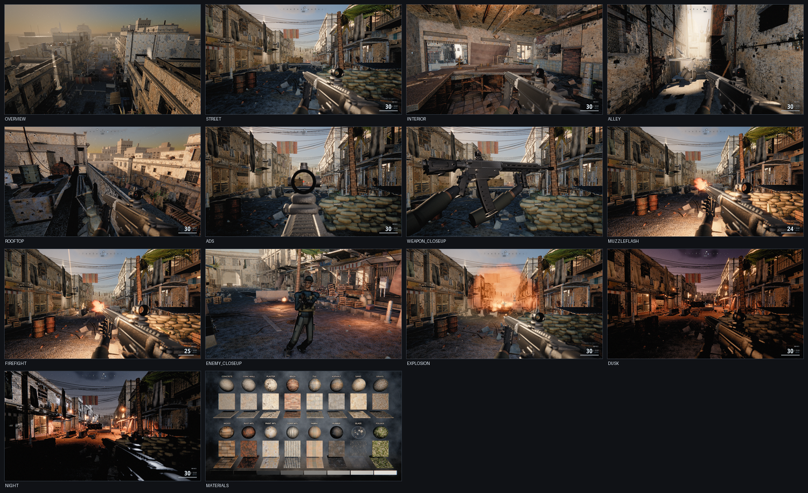
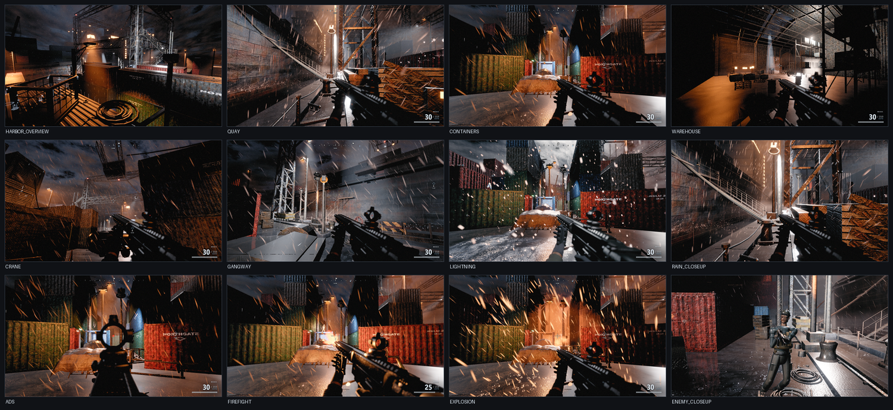

# OPERATION BLACKOUT

A first-person shooter built in Three.js r180. ~55,000 lines of game code,
zero external assets, zero build step.

**Level 1 — Al-Bakr Market District.** Golden hour, dust, a war-torn market street.



**Level 2 — Cold Harbor.** 02:00, a storm, a container terminal. Reached with
`index.html?level=harbor`.



## Play it

**Double-click `index.html`.** That's it — no server, no install, no npm.

Click **DEPLOY**, then click once more to lock the mouse.

| Input | Action |
|---|---|
| `W` `A` `S` `D` | Move |
| `Shift` | Sprint |
| `C` / `Ctrl` | Crouch (sprint + crouch = slide) |
| `Space` | Jump / mantle ledges |
| Mouse | Look |
| Left click | Fire |
| Right click | Aim down sights |
| `R` | Reload |
| `1` `2` | Switch weapon |
| `Esc` | Release mouse |

Chrome or Edge recommended. A discrete GPU will hold 60fps at 1080p.

## Levels

| Level | id | Conditions |
|---|---|---|
| Al-Bakr Market District | `market` (default) | Golden hour, hot, dusty, horizontal street canyon |
| Cold Harbor Container Terminal | `harbor` | 02:00, heavy rain, storm, lit only by sodium/mercury practicals and lightning |

Select with `index.html?level=harbor`. A level is a `Level`+`Props` pair
registered in the `LEVELS` table in [src/game/main.js](src/game/main.js); no
other system knows which one is loaded — they branch on `ctx.levelId`. An
unknown or failed level falls back to `market` rather than blanking the screen.

The two are deliberate opposites — night against day, wet against dry,
practicals against sun, vertical against horizontal — because a second level
that re-dresses the first is not a second level. Cold Harbor's look is carried
by reflection and specular where the market's is carried by haze.

## What's unusual about this build

**Nothing is loaded — everything is generated.** There is not a single `.png`,
`.jpg`, `.hdr`, `.glb`, `.mp3` or font file anywhere in the project, and no
network request at runtime. Every texture is synthesised into a canvas from
noise fields, every mesh is built from code, every gunshot is layered oscillators
and filtered noise through a procedurally generated impulse response, and the
sky is a real atmospheric-scattering integral evaluated into a lookup table.

That constraint wasn't a stylistic choice — this machine has no Node.js and no
npm, so there was no bundler and no asset pipeline to lean on. `file://` blocks
`fetch`, `XHR` and ES modules, which rules out loading anything at runtime.

**Three.js is vendored as a classic script.** `tools/build_three_global.py`
merges r180's two ESM files into a single IIFE exposing `window.THREE`. They
declare colliding top-level helpers, so each gets its own scope with the
module's imports re-injected from the core's export object.

**The renderer is hand-written.** `examples/jsm` isn't available, so there's no
`EffectComposer`, no `*Pass`, no CSM helper. The post-processing chain (GTAO,
TAA with YCoCg neighbourhood clipping, a Jimenez bloom pyramid, volumetric
raymarching, motion blur, AgX tonemapping, grade), the 4-cascade PCSS shadow
rig with texel snapping, and the decal system are all written from scratch.

## Layout

```
index.html              entry point — loads vendor + 17 game scripts in order
vendor/three.global.js  three.js r180 as a classic script (generated)
src/core/util.js        math, seeded RNG, noise, collision, pooling, input
src/render/             textures, materials, sky+atmosphere, lighting, postfx
src/world/              level architecture + collision, props and set dressing
                        level.js/props.js = market, level_harbor.js/
                        props_harbor.js = harbor
src/player/             movement, camera, game feel
src/weapons/            procedural weapon models, viewmodel animation, ballistics
src/fx/                 particles, impacts, decals, tracers, explosions
                        weather.js = rain, storm, lightning (owns the
                        weather contract other systems consume)
src/audio/              fully synthesised audio
src/ai/                 enemy AI, procedural humanoid rig and animation
src/ui/                 DOM/CSS HUD
src/game/               bootstrap, frame loop, capture scenarios
ARCHITECTURE.md         the contract the 14 modules were built against
ART_DIRECTION.md        the single image every module converges on (level 1)
ART_DIRECTION_HARBOR.md  the same, for level 2
DEVELOPMENT.md          how to extend this without breaking it
docs/technical-writeup.md  technical write-up (renders on GitHub)
```

## Technical write-up

[docs/technical-writeup.md](docs/technical-writeup.md) is a full write-up of
the architecture, the rationale for generating every asset from code, the
agent-orchestration methodology, the verification tooling, six case-study bugs,
and where the technique does and does not transfer to other projects.

It includes the measured cost of the project (~39.2M tokens across 147 agent
runs), an analysis of where this method breaks down, and embedded captures and
animated demos. Markdown, so it renders directly on GitHub.

## Contributing

Read [DEVELOPMENT.md](DEVELOPMENT.md) before changing anything — the
constraints above are load-bearing, and a few (colour space, where tone mapping
happens, `Math.random()` breaking capture determinism) fail silently rather
than loudly.

Quick loop: `python tools/check.py --all` after every edit,
`python tools/playtest.py` for gameplay changes, `python tools/shoot.py --all`
plus `python tools/analyze.py` before claiming anything looks better.

## Development tooling

Everything is Python 3 + headless Chrome. No Node required.

```bash
python tools/build_three_global.py   # regenerate the vendored three.js
python tools/check.py --all          # every module loads and constructs cleanly
python tools/shoot.py --all          # render 14 deterministic scenarios to shots/
python tools/analyze.py shots/*.png  # objective image metrics
python tools/sheet.py                # contact sheet of all captures
python tools/playtest.py             # boot the real interactive path, drive
                                     # 600 frames of scripted input, report state
```

`shoot.py` renders through SwiftShader and serves over an ephemeral localhost
server rather than `file://`, because `file://` gives scripts an opaque origin
and collapses every JS error to `"Script error."` with no line number.

`analyze.py` reports exposure, black crush, highlight clipping, edge density,
untextured-area fraction, and the shadow/highlight tint split. Its `repetition`
metric is **advisory only** — it collapses each image row to a mean, so on a 3D
perspective scene it largely measures profile smoothness rather than texture
tiling. Don't tune against it.

## Known limitations

- Enemy faces read at conversational distance but not in extreme close-up.
- The alley and interior are the weakest of the five hero framings.
- SwiftShader captures take 1–4 minutes each; that's the software rasteriser,
  not the game.
- Performance is tuned for a discrete GPU. Integrated graphics should use
  `?quality=medium` or `?quality=low`.
