# OPERATION BLACKOUT

## A 122,000-line AAA-target FPS with zero art assets, built by orchestrated AI agents

*Technical write-up — architecture, methodology, findings, and applicability to future game development.*

---

# 1. Executive summary

**What it is.** A first-person shooter in the browser, built on Three.js r180, with **10 distinct levels**. It runs by double-clicking a single `index.html` — no server, no build step, no install, no package manager.

**What is unusual about it.** There is not a single image, 3D model, audio file or font anywhere in the project, and no network request at runtime. Every texture is synthesised from noise fields into a canvas, every mesh is built from code, every gunshot is layered oscillators and filtered noise through a procedurally generated impulse response, and the sky is an atmospheric-scattering integral evaluated into a lookup table.

**How it was built.** By fan-out orchestration: waves of parallel AI agents, each owning exactly one file, with adversarial critic agents grading rendered frames against a AAA bar and routing findings back to the owning module. Roughly 100 agent-runs across nine orchestrated workflows.

| Metric | Value |
|---|---|
| Game source | 121,758 lines across 28 JavaScript modules |
| Tooling | 1,616 lines of Python across 9 tools |
| Design docs | 1,138 lines of Markdown contracts |
| Levels | 10, each with a distinct time of day, weather, light source and palette |
| External assets | **0** |
| Runtime network requests | **0** |
| Build steps | **0** |
| Typical frame | 230–430 draw calls, 1.5–4.2M triangles |

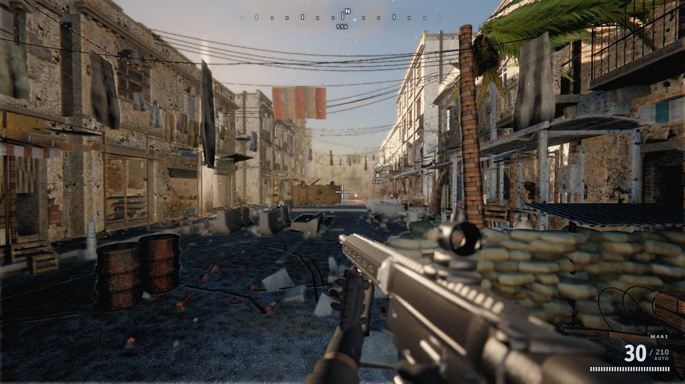

*Level 1, Al-Bakr Market District. Every surface, the weapon, the sky and the atmosphere in this frame is generated from code at boot. No image, model or audio file exists anywhere in the project.*

## 1.1 Live demonstrations

Three recorded sequences. Stills cannot show the systems that matter most — weather, muzzle flash, recoil, and a lightning strike relighting a scene — so the engine has a record mode that steps a fixed timestep and captures each rendered frame.

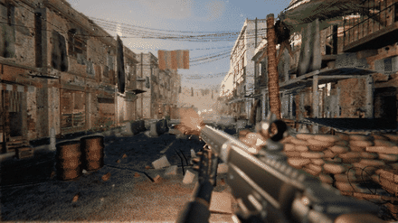

*DEMO 1 — Firing, level 1. Procedural muzzle flash (star-shaped billboard, blackbody core, forward sparks, and a PointLight that briefly lights the world), spring-damped weapon recoil, shell ejection, and camera impulse. All animation is procedural; there is no keyframe data in the project.*

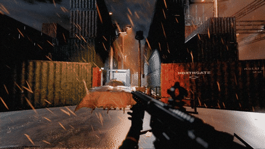

*DEMO 2 — Lightning, level 2. Rain streaks sheared by wind with depth parallax, wet ground holding reflections, and a multi-stroke lightning strike that is a real light casting real shadows rather than a screen fade. Thunder is scheduled afterwards at a delay matching the strike distance.*

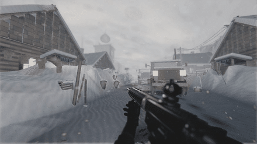

*DEMO 3 — Blizzard, level 3. Snow is not recoloured rain: flakes tumble and drift, move far slower, are affected far more by wind, and vary in size with strong depth parallax. Whiteout haze swallows distance.*

---

# 2. The central technical decision: no traditional art assets

## 2.1 It began as a constraint, not a thesis

The target machine had **no Node.js and no npm**. That single fact cascaded:

- No npm meant no bundler — so no `import`/`export`, and the game had to ship as classic `<script>` tags.
- Shipping as plain scripts meant running from `file://`, which blocks `fetch`, `XMLHttpRequest` and ES modules entirely.
- No fetch meant **nothing could be loaded at runtime** — no textures, no models, no audio, no fonts, no CDN.
- No bundler also meant no asset pipeline: nothing to convert, pack, or preprocess anything.

The only remaining option was to generate every asset in code at boot. What started as a limitation turned out to have properties worth choosing deliberately.

## 2.2 What procedural generation actually bought

| Property | Consequence |
|---|---|
| **Distribution size** | The entire game is ~4 MB, of which 2.1 MB is the Three.js library itself. A comparable asset-based game is 10–100 GB. |
| **No pipeline** | No import, no packing, no LOD baking, no texture compression step, no asset server. Change a number, reload. |
| **Infinite variation** | A texture generator produces a family, not a file. Per-instance seeds give every container, every snowdrift, every rust streak its own variation at no storage cost. |
| **Parametric art direction** | Wetness, grime, edge wear and damage are *parameters*, so a whole level can be made wet, or a material aged, by moving one value. |
| **No licensing surface** | Nothing is derived from third-party assets, photographs or scans. |
| **Agent-authorable** | An AI agent cannot paint a texture or sculpt a mesh, but it can write the *code that generates them*. |

That last point deserves emphasis. **The choice of a code-based content representation is what made agent-driven development of a visually rich game possible.** Assets are opaque binaries to a language model; generators are source code, which is the medium it works in natively. The constraint and the method turned out to be well matched.

## 2.3 What it cost

An honest accounting:

- **Human faces and organic detail are hard.** Procedural characters read convincingly at conversational distance and poorly in extreme close-up. Photogrammetry wins decisively here.
- **Boot cost replaces download cost.** Texture generation is the single largest boot expense (~2.2 s single-threaded). The cost moved rather than disappeared.
- **Art direction becomes programming.** Changing a look means editing a generator, not repainting a texture — slower for a trained artist, faster for an agent.
- **Everything must be written.** With no `examples/jsm`, the post-processing chain, cascaded shadow maps, and decal system all had to be implemented from scratch.

---

# 3. Architecture

## 3.1 Hard constraints (the contract every module obeys)

| Constraint | Consequence |
|---|---|
| No Node.js / npm / bundler | Classic `<script>` tags, IIFE-wrapped modules |
| Runs from `file://` | `fetch`, XHR and ES modules are blocked |
| Zero external assets | All content generated in code |
| No `examples/jsm` | No EffectComposer, no `*Pass`, no OrbitControls, no BufferGeometryUtils |
| No `Math.random()` | Seeded RNG only, or captures stop being reproducible and the critic loop becomes worthless |
| Never throw from lifecycle methods | One exception blanks the screen for all 15 systems |

## 3.2 Vendoring Three.js as a classic script

Three.js r180 ships as ES modules split across `three.core.js` and `three.module.js`. A build step converts them into one classic script exposing `window.THREE`. Naive concatenation fails: both files declare colliding top-level helper names. The transform gives each its own function scope and re-injects the module's imports from the core's export object.

```js
(function () {
  'use strict';
  var __core = (function () { /* three.core.js body */
    return { Vector3: Vector3, Matrix4: Matrix4, /* ...425 exports */ };
  })();
  var __mod = (function (__core) {
    var Vector3 = __core.Vector3;        // 188 re-injected imports
    /* three.module.js body */
    return { WebGLRenderer: WebGLRenderer, /* ... */ };
  })(__core);
  window.THREE = { /* 422 public exports merged */ };
})();
```

## 3.3 Module registration and file ownership

Every file is an IIFE hanging itself off a single global namespace. No module declares a global.

```js
(function (GAME, THREE) {
  'use strict';
  class TextureLibrary {
    constructor(ctx) { this.ctx = ctx; }
    async build(ctx) { /* heavy generation, yields between chunks */ }
    update(dt, ctx) {}
  }
  GAME.TextureLibrary = TextureLibrary;
})(window.GAME, window.THREE);
```

**File ownership is the concurrency primitive.** Exactly one agent may write a given file in a given wave. This is the single most important rule in the whole methodology: it is what allowed 14 agents to write 35,000 lines simultaneously and have it integrate on the first attempt with zero errors. Cross-module communication happens only through documented APIs, and every call is defensively guarded so a missing or broken dependency degrades instead of cascading.

## 3.4 The context object and system lifecycle

A single `ctx` object is constructed by `main.js` and passed to every system. Systems are built in a fixed order, so a system may only depend on what was built before it.

```js
class System {
  constructor(ctx) {}      // cheap wiring only
  async build(ctx) {}      // heavy generation; may yield via GAME.yieldFrame()
  update(dt, ctx) {}       // per-frame simulation
  resize(w, h, ctx) {}     // viewport change
}
```

Boot order: textures → materials → sky → lighting → postfx → level → props → player → weapons → ballistics → vfx → weather → audio → ai → hud.

## 3.5 The level registry and declarative environments

This is the architectural change that made scaling from 2 levels to 10 tractable. Originally `Level` was a single hardcoded class, and every new level required edits to `sky.js`, `lighting.js` and `postfx.js` — which would have serialised eight parallel builds onto the same four files.

A level is now a `Level`+`Props` pair registered in a table, selected with `?level=<id>`, carrying a **declarative environment profile**:

```js
snowbound: {
  name: 'Kirovsk Pass',
  level: 'LevelSnowbound', props: 'PropsSnowbound',
  env: {
    timeOfDay: 0.30, sky: 'overcast', weather: 'blizzard', turbidity: 0.09,
    grade: 'cold', exposure: 0.15, lightRig: 'sun', interior: false
  }
}
```

`main.js` applies the profile after the build pass by calling existing public APIs — `sky.setWeather()`, `weather.setPreset()`, `postfx.setGradePreset()`, `lighting.setRig()` — each call individually guarded so an unimplemented preset is skipped rather than fatal. **Adding a level now requires zero shared-system edits.**

The two originally-shipped levels deliberately carry `env: null` and keep their legacy path, so they cannot be regressed by a profile change. An unknown or failed level logs clearly and falls back rather than blanking the screen.

## 3.6 Rendering pipeline (all hand-written)

With no `examples/jsm`, everything below was implemented from scratch on top of raw `WebGLRenderTarget`, `DepthTexture`, `ShaderMaterial` and a fullscreen triangle:

- **Composer** — ping-pong HDR render targets (HalfFloat), MRT for depth/normal/velocity
- **GTAO** — horizon-arc ambient occlusion with depth-aware bilateral blur
- **TAA** — Halton(2,3) jitter, velocity reprojection, YCoCg neighbourhood clipping, Catmull-Rom history
- **Bloom** — progressive downsample/upsample pyramid with tent filters, not a single gaussian
- **Volumetrics** — raymarched light shafts with blue-noise dithered offsets
- **Motion blur** — per-pixel velocity-buffer directional blur
- **SSR** — screen-space reflections with binary refinement, thickness testing and roughness-aware blur
- **Tonemap + grade** — AgX curve, then a 9-preset colour grade system
- **CSM** — 4-cascade PCSS shadows with texel snapping (without snapping, shadow edges crawl as the camera moves)

---

# 4. Procedural content generation

## 4.1 Textures: height-first authoring

Every material is generated at 512–1024px into an offscreen canvas. The critical design decision is **height-first**: author a height field, then *derive* everything else from it, so all maps agree physically.

1. **Base tone** with large-scale fbm variation so nothing is ever flat
2. **Material structure** — worley cells for concrete aggregate, ridged noise for cracks, directed streaks for rust weeping, lattices for brick and tile
3. **Wear pass driven by the height map** — grime accumulates where height is *low*, edge wear appears where height is *high*. This correlation is what makes wear read as physical rather than painted.
4. **Normals by Sobel differencing** of the height field
5. **AO by cavity approximation** — sampling height in a neighbourhood, not merely inverting height
6. **Roughness varying spatially** and telling the material's story

Textures tile seamlessly by sampling noise **on a torus** (wrapping coordinates), verified numerically rather than by eye. Nyquist guards drop octaves below ~3 texels, because differentiating near-Nyquist height produces sparkling confetti normals.

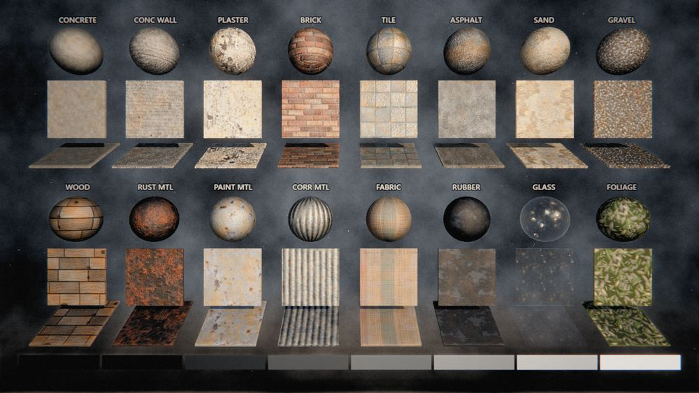

*The material test chart — a first-class capture scenario showing every generated material as a lit sphere and a flat plate. Concrete, plaster, brick, tile, asphalt, sand, gravel, wood, rusted and painted metal, corrugated sheet, fabric, rubber, glass and foliage, all generated from noise fields with no source imagery. This chart is how library-wide failures get caught: a specular test across these spheres revealed that NOT ONE material in the entire build produced a highlight, because roughness floors had been clamped.*

## 4.2 Materials: shader injection over stock Three.js

Materials extend `MeshStandardMaterial` via `onBeforeCompile`:

- **Reoriented normal mapping (RNM)** — blends a high-frequency detail normal at ~12× base tiling. This is what stops surfaces reading as plastic at close range.
- **Stochastic tiling** — variance-preserving random per-tile offset/rotation to break lattice repetition
- **Whiteout triplanar** — world-space projection with per-axis sign correction, no UV stretching
- **Parallax occlusion mapping** — 8–16 steps with `textureGrad`, distance-faded
- **A vertex wear contract** — the vertex colour channels carry meaning: `R = grime`, `G = wetness`, `B = edge wear`, white = pristine.

That wear contract turned out to be one of the highest-leverage decisions in the project. When a rain level was added later, it got physically correct wet PBR essentially for free — wetness darkens diffuse ×0.48, collapses roughness toward 0.09, and raises specular F90 to 1.0. Levels paint wetness into vertex colours; nobody had to invent a parallel system.

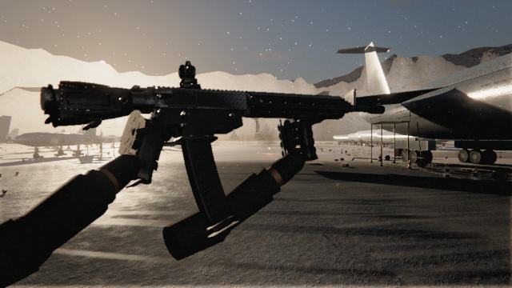

*The first-person weapon, generated entirely from bevelled primitives and lathed profiles — M-LOK handguard cut-outs, Picatinny rail teeth, charging handle, ejection port, magwell flare, a curved STANAG magazine with witness holes, and a red-dot optic. Worn anodised black with edge wear revealing bare aluminium on rail edges and mag lips. Gloved hands with articulated fingers wrap the grip and foregrip.*

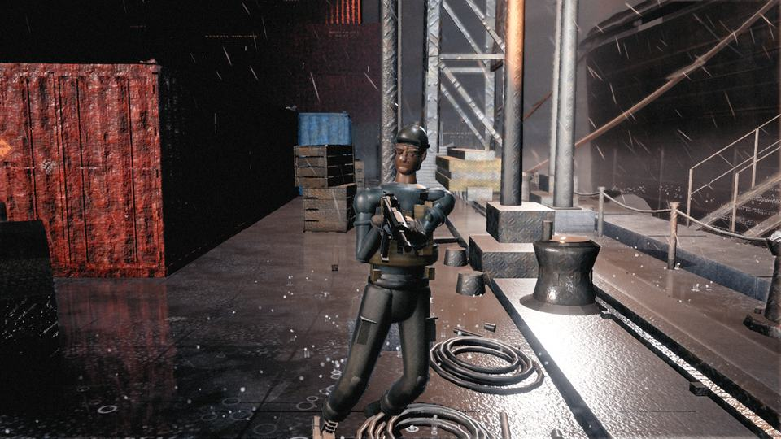

*A procedural humanoid: a real bone hierarchy at correct anthropometry (288 mm humerus, 258 mm forearm on a 1.8 m figure), with a face built from a height field carrying brow ridge, zygomatic arch, nasal projection and gonial angle. All animation is procedural — contrapposto idle, gait-phase locomotion, foot IK, hit reactions and a verlet ragdoll on death. There are no animation files.*

## 4.3 Audio: every sound synthesised at runtime

There are no audio files. A gunshot is assembled from four layers through the Web Audio API:

1. **Transient** — a sub-2ms burst of filtered white noise with a downward-sweeping bandpass
2. **Body** — filtered noise plus a pitch-dropping low sine, giving the shot weight (~80–150ms)
3. **Mechanical** — a metallic bolt-cycle click layered slightly after
4. **Tail** — convolution against a *procedurally generated* impulse response, plus discrete slap-back echoes at delays plausible for the space

Impulse responses are generated as exponentially-decaying filtered noise with early reflections, one per environment preset. The same weapon sounds materially different in a market street, a container canyon and a metro tunnel — because the convolution reverb differs, not because a different file was loaded. Per-shot pitch and filter jitter stops bursts sounding machine-identical.

*Note: the audio cannot be embedded in this document. It exists only as runtime synthesis. An attempt to render it offline via `OfflineAudioContext` is included in the repo (`tools/audio_render.py`) and is documented as not yet working — Chrome's virtual-time clock does not advance offline audio rendering. The diagnosis is in the file header.*

---

# 5. Development methodology: orchestrated agent fan-out

## 5.1 Structure

Work is organised into workflows, each a deterministic script that spawns agents:

```
Phase 1  BUILD     N agents in parallel, one per owned file
Phase 2  CRITIQUE  M adversarial critics, each with a distinct visual lens
Phase 3  FIX       one agent per file that received findings
Phase 4  VERIFY    a single agent that recaptures and reports honestly
```

Findings are routed by *owning file*, so the fix phase never has two agents in the same file. Multi-stage work uses a pipeline rather than a barrier, so a level can be in its dressing stage while another is still building geometry.

## 5.2 What made the prompts work

| Technique | Why it mattered |
|---|---|
| **A binding written contract** | ARCHITECTURE.md defined APIs, ownership and lifecycle before any code existed. 14 agents wrote 35,000 lines concurrently and it integrated first try. |
| **A single shared target image** | An art-direction document describing *one specific photograph* the whole team converges on. Without it, 14 individually good modules produce an incoherent scene. |
| **Constraints stated as consequences** | Not "don't use fetch" but "runs from file://, so fetch is blocked". Agents that understand *why* extrapolate correctly to cases the prompt never mentioned. |
| **Instant-fail lists** | Concrete disqualifiers ("muzzle flash that is a white sphere", "enemies as capsules") are far more actionable than "make it look good". |
| **Measured acceptance criteria** | "Night must measure mean luminance above 0.10 with positive grade split" is checkable. "Make night look better" is not. |
| **Prior findings carried forward** | Each wave's brief includes the hard-won lessons of the last, as requirements. This is how the project accumulates knowledge across agent generations that share no memory. |
| **Explicit anti-overcorrection** | After one round turned a too-white weapon into a too-black one, every later brief said: move toward the target and *measure*, do not swing past it. |

## 5.3 The adversarial critic loop

Critics are prompted as harsh art directors who have shipped AAA titles, explicitly told not to praise effort and not to grade on a curve for "it's WebGL". They score 0–100 against a shipped title, and their findings name one owning file and one concrete technical remedy.

The decisive insight: **critics that read source code and probe the live scene graph find things that critics who only look at screenshots cannot.** The three highest-value findings of the entire project were all invisible in an image:

- A live probe returning `emissiveLamps: 0` — the scene had no actual light sources, only lit surfaces
- Zero specular response across all 16 chart materials, because the material table clamped roughness floors to ≥0.60 — "everything in this world is chalk"
- Five purpose-built textures generated every boot and silently discarded by a name redirect — sandbags were literally wearing a market awning

---

# 6. Verification tooling

The tooling is what separates this from "generate code and hope". All of it is Python 3 driving headless Chrome — no Node required.

| Tool | Purpose |
|---|---|
| `build_three_global.py` | Converts Three.js ESM into the vendored classic script |
| `check.py` | Loads each module in isolation over localhost; catches parse errors and boot throws in ~1 minute |
| `shoot.py` | Renders deterministic capture scenarios to PNG with draw calls, triangles and JS errors |
| `analyze.py` | Objective image metrics — the numeric half of the critic loop |
| `sheet.py` | Contact sheets for reviewing many captures at once |
| `playtest.py` | Boots the *real interactive path* and drives 600 frames of scripted input |
| `record.py` | Records animated sequences (rain, muzzle flash, lightning) that stills cannot show |

## 6.1 Determinism is a prerequisite

Captures simulate at a fixed 1/60 timestep from a seeded RNG, so a given (scenario, time, seed) always produces the identical frame. Without this, the critic loop cannot distinguish an improvement from noise. This is why `Math.random()` is banned project-wide.

## 6.2 Serving over localhost, not file://

The shipped game runs fine from `file://`, but `file://` gives scripts an opaque origin, collapsing every JS error into `"Script error."` with no line number. Test tooling serves the same tree over an ephemeral localhost server purely to restore real stack traces — which is what made multi-module integration debuggable at all.

## 6.3 Objective metrics, and their limits

`analyze.py` reports exposure, black crush, highlight clipping, edge density, untextured-area fraction, the shadow/highlight tint split, and frame coverage. Each maps to a specific failure mode:

| Metric | Catches |
|---|---|
| `crushed_black_pct` | Shadows dying to detail-free black |
| `dynamic_range` | Flat, washed images |
| `flat_area_pct` | Missing texture / normal / roughness detail |
| `grade_split` | Whether the colour grade is landing at all |
| `coverage.dead_cell_pct` | Regions containing nothing a player could see |
| `coverage.vertical_imbalance` | An unlit or missing ground plane |

**Two metrics earned their place by catching things human review missed.** `grade_split` caught the colour grade *inverting* at night (−0.0198 against +0.11 everywhere else) in a frame that looked acceptable as a thumbnail. The `coverage` metrics were added after mean luminance reported an entirely **black** frame as healthy — a bright fog ceiling averaged against a dead floor produces a perfectly normal-looking number.

**But metrics are necessary, not sufficient — and this is the most important methodological lesson in the project.** A later round passed every coverage check at 0.0% dead cells while a large untextured mound occupied half the frame. Coverage detects missing *light*, not missing *material*. Two failure modes were also found only by driving the game rather than photographing it. Any verification system has a shape, and bugs hide in its blind spots.

## 6.4 Testing the interactive path, not just the capture path

All visual verification runs through capture mode, which freezes the player and steps a fixed timestep. That is a *different code path* from the one a player uses. `playtest.py` boots the real interactive path, fakes pointer lock, dispatches synthetic keyboard and mouse events, and pumps 600 frames while recording the player state histogram, peak speed, ammunition behaviour and errors.

It immediately found three bugs invisible to every screenshot: boot hanging forever in a background tab, the player dying within 10 seconds of spawn, and sprint never engaging.

---

# 7. Case studies: the bugs worth reading about

## 7.1 The level that rendered as a black void

The night harbour level shipped its first build as black voids with floating light cones. Draw calls and triangle counts were healthy; nothing errored.

The hypothesis — the orchestrator's — was that a shader patch rewriting Three.js's `lights_fragment_begin` had broken spotlight accumulation. **An agent disproved it by experiment rather than argument**: it built a probe page rendering an isolated SpotLight through the *same patched shader chunks* (lit correctly, peak byte 203/255), then dumped the patched chunk and showed that in r180 the point and spot loops run *before* the directional loop, so the patch landed inside the directional loop only.

The real cause was a **dynamic range failure**. A mast lamp put ~10 lux on the apron while indirect fill put ~0.02 lux anywhere a cone did not reach — 500:1, past what any tone curve holds, so the unlit half fell off the toe. The proof was elegant: every "dead" grid cell printed the post-processing black level at *exactly the same value*, whether it contained a container flank, the apron, or nothing at all.

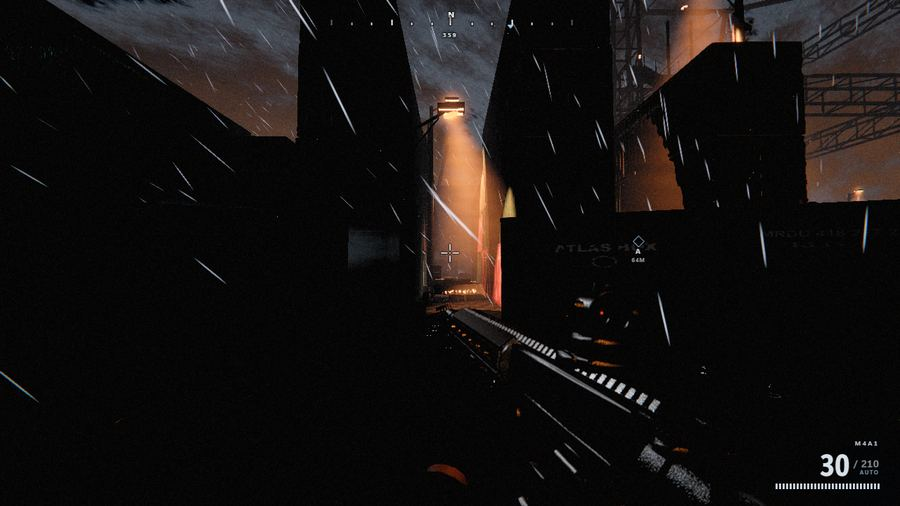

*THE BUG. The level rendering at essentially zero light. Draw calls and triangle counts were healthy and nothing errored — the geometry is all present, it simply receives no usable illumination. Every "dead" region printed the post-processing black level at exactly the same value regardless of what geometry it contained, which is what identified the cause as tone-curve failure rather than missing lights.*

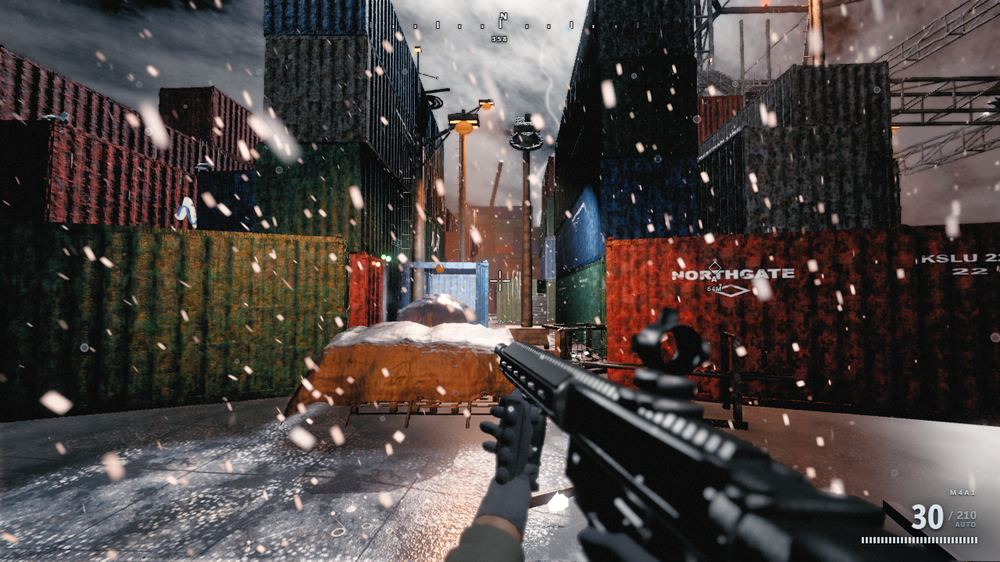

*THE SAME LEVEL, FIXED. Lit apron holding reflections, container liveries and stencils legible, volumetric lamp cones through rain, and a lightning strike relighting the scene from a different direction. Measured: dead-frame coverage 23.4% to 0.0%, vertical imbalance 3.70 to 0.95.*

**Transferable lesson:** keep the ratio between lit and unlit regions within ~50:1. And raising global indirect constants was shown, across three separate passes, to be close to a *null operation* — because auto-exposure meters the frame and hands the lift straight back. The fix was local: light sources moved into the near field of each framing.

## 7.2 Nothing in the world had a specular highlight

A critic ran a specular test across all 16 spheres of the material chart: **not one produced a highlight.** Glass authored at roughness 0.10 responded identically to concrete at 0.92. The generators were authoring full-range roughness, and the material table was then clamping 14 of 26 definitions to a floor of ≥0.60, stacking three grime pulls toward 0.95 against one wear pull measuring 0.029 in-scene. Every surface in the game was chalk.

**Transferable lesson:** build a material test chart as a first-class scenario. Isolated, lit, labelled spheres and plates make library-wide failures obvious that no level screenshot reveals.

## 7.3 The tarpaulin that became a mirror

A large untextured, visibly faceted pale mound appeared in the foreground of seven framings. The obvious diagnosis — a missing material — was wrong.

Instrumentation showed the material resolving correctly, with all maps present and smooth vertex normals. The actual cause: the tarpaulin's crown was modelled as a dead-flat horizontal plane, so the screen-space reflection pass's wetness heuristic classified it as **standing water** and rendered it as a mirror, with normals reconstructed per-triangle from depth taps — producing both the whiteness and the facets. The fix was physical rather than technical: give the sheet real camber and lashing creases so it sheds water, as a tarpaulin does.

**Transferable lesson:** heuristics that infer material properties from geometry will misclassify. Flat-and-horizontal is not the same as wet.

## 7.4 Time of day that did nothing

Noon, dusk and night measured mean luminance 0.404, 0.415 and 0.413 — statistically identical. The scene *looked* plausible in each case, which is exactly why it survived visual review. Auto-exposure was normalising every scene to the same mean and erasing the difference. After the fix: 0.371 / 0.150 / 0.130.

## 7.5 Boot hanging in a background tab

Heavy generation yields between systems via `requestAnimationFrame` so the loading screen can paint. But **rAF does not fire in a hidden or backgrounded tab** — so opening the game in a background tab hung it on the loading screen forever. Found by the playtest harness, not by any capture. Fixed by racing rAF against a timer.

## 7.6 An acceptance metric that measured the wrong thing

A tiling-detection metric was set as a hard acceptance gate for an entire fix round. A critic demonstrated it was unsound: it collapses each image row to a mean, so on a 3D perspective scene it measures profile smoothness rather than texture repetition — reporting the same peak for two frame halves showing entirely different walls, while other captures using identical materials scored ~0.00. The gate was withdrawn mid-round and the metric downgraded to advisory with the reasoning documented in-tree.

**Transferable lesson:** an acceptance target that measures the wrong thing is worse than no target, because it directs effort confidently in the wrong direction.

---

# 8. Results

Ten levels, each pinned to a different point in time-of-day, weather, light source, spatial character and dominant material family — because a second level that re-dresses the first is not a second level.

| Level | Time | Condition | Light source | Space |
|---|---|---|---|---|
| Al-Bakr Market | golden hour | hot, dusty | raking sun | horizontal street |
| Cold Harbor | 02:00 | storm, rain | sodium + lightning | vertical canyons |
| Kirovsk Pass | overcast day | blizzard | diffuse whiteout | open valley + village |
| Line 4 — Zarechnaya | none (underground) | flooded | emergency fluorescents | tight tunnels |
| Meridian Tower | sunset | clear, windy | low sun + interior | extreme vertical |
| AMARG Boneyard | high noon | arid, heat haze | brutal overhead sun | vast flat sprawl |
| Facility K-17 | none (buried) | dry, dusty | failing lights + alarm | claustrophobic |
| Mekong Delta | midday | humid, drizzle | filtered canopy light | dense organic |
| Zubair Refinery | dusk | clear | flare stacks + floods | industrial lattice |
| Bayon Ruins | dawn | ground mist | soft low sun | stone courtyards |

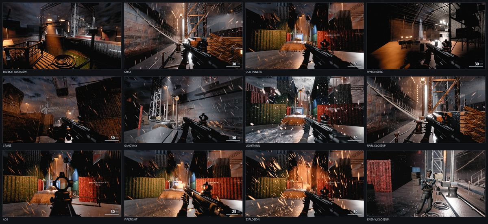

*Level 2 — Cold Harbor, all twelve capture scenarios. A rain-lashed container terminal at 02:00, lit only by sodium and mercury practicals and by lightning. Deliberately the inverse of level 1 on every axis: night against day, wet against dry, practicals against sun, vertical canyons against a horizontal street.*

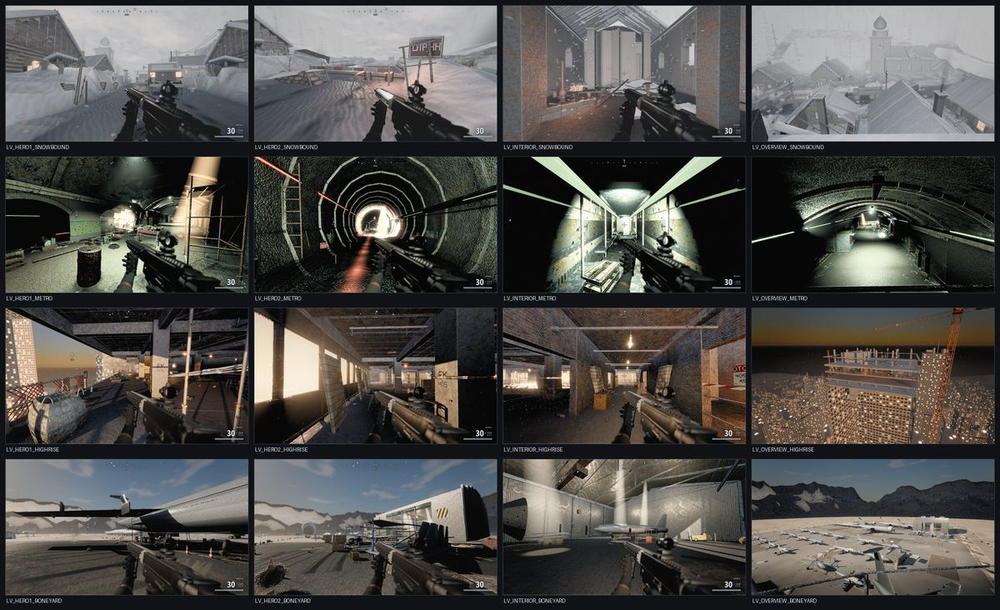

*Levels 3–6. Top to bottom: Kirovsk Pass (blizzard whiteout), Line 4 Zarechnaya (flooded metro, lit only by failing fluorescents), Meridian Tower (unfinished skyscraper at sunset), AMARG Boneyard (desert aircraft storage at brutal noon). Each is pinned to a different point in time-of-day, weather, light source, spatial character and material family.*

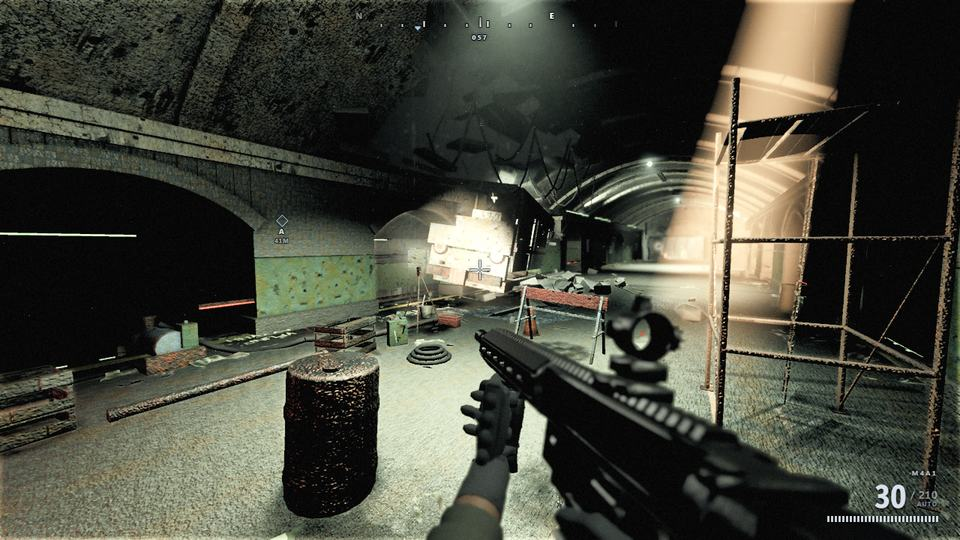

*Line 4 — Zarechnaya. A sealed level with no sky at all: every photon comes from emergency fluorescent strips and worklights. The sickly green grade, standing water and tunnel geometry are all driven by the level's declarative environment profile — no shared rendering system was edited to produce this look.*

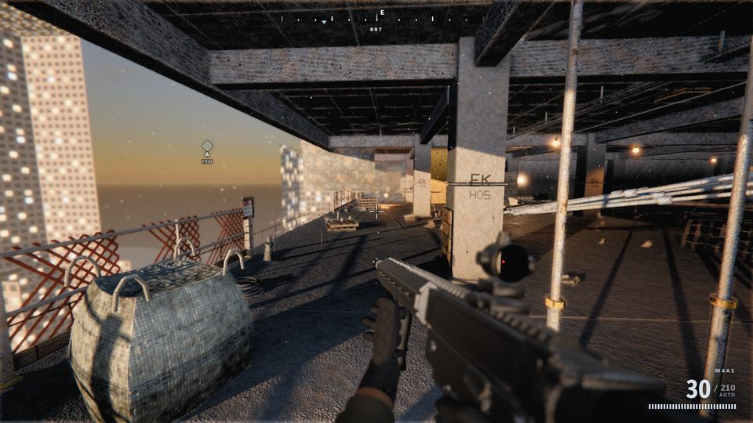

*Meridian Tower. An unfinished floor plate at sunset, with the low sun raking through open edges and a city stretching below. Verticality, exposed structure and depth haze.*

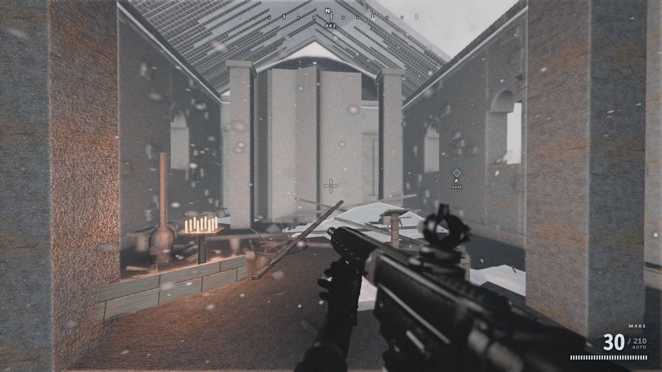

*Kirovsk Pass, interior. A dacha interior — the same procedural material library that produces desert plaster and container steel also produces timber, stove iron and snow-light through a window.*

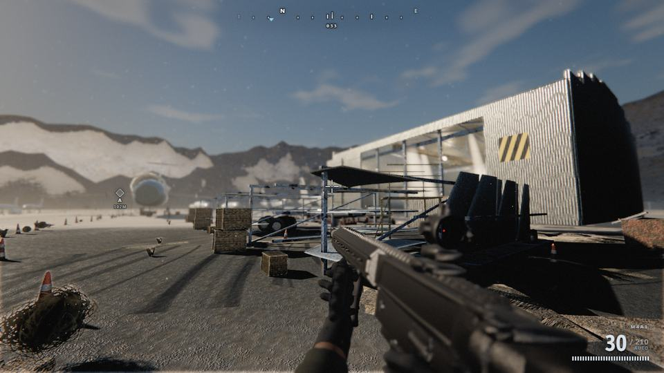

*AMARG Boneyard. High noon in the desert is the hardest lighting condition in the roster: short hard shadows, bleached highlights, and a real risk of a flat contrastless frame. The enormous airframes are used to throw deep shade to fight in.*

Every image and animation in this document was rendered by the headless capture tooling described in section 6, from a seeded deterministic simulation.

---

# 9. Applicability to future game development

## 9.1 Where procedural content generation genuinely wins

- **Surface detail and material variation.** Procedural PBR is competitive with authored textures for architectural and industrial surfaces, and strictly better at variation-per-byte.
- **Environment and weather.** Atmosphere, sky, fog, rain and snow are parametric by nature and suffer nothing from being generated.
- **Modular architecture and set dressing.** Buildings composed from a parametric kit with per-instance variation avoid the visible repetition of a fixed prop library.
- **Anything needing infinite variety.** Rust patterns, debris fields, crowd variation, damage states, wear — storage-free at any scale.
- **Distribution-constrained contexts.** Web games, instant-play, embedded, demoscene, and any platform where a multi-gigabyte download is disqualifying.

## 9.2 Where it does not

- **Hero characters and faces.** Photogrammetry and hand-sculpting remain decisively better.
- **Narrative-specific assets.** A particular actor's likeness, a scripted set piece, a branded object — anything where the point *is* the specific artefact.
- **Anything an artist can simply draw faster.** Procedural generation is an engineering investment; it pays back on variation and scale, not on one-offs.

## 9.3 The hybrid future this suggests

The interesting position is not "procedural instead of authored" but **procedural as the substrate, authored as the accent**: generate the world, its surfaces, weather and dressing from code; hand-author the handful of hero assets the player looks at closely. That is roughly what large open-world productions already do, and the technique here extends how far the generated portion can be pushed.

## 9.4 The methodology is the more transferable result

Independent of procedural graphics, several practices here transfer to any AI-assisted software project of scale:

1. **File ownership as the concurrency primitive.** One writer per file per wave. This is what makes massive parallelism safe, and it is a scheduling constraint, not a code-review policy.
2. **Write the contract before the code.** An interface document that agents must satisfy is what allows dozens of independently written modules to integrate.
3. **Build the verification harness first.** Here, headless rendering plus objective metrics existed before the game did. Agents cannot self-assess visual work without a way to see it.
4. **Make the machine look at the output.** Screenshot-and-measure closed the loop between "code compiles" and "product is correct" — the gap where most generated code fails.
5. **Adversarial review as a separate role.** Critics with no authorship stake, prompted to be harsh and to name one owning file per finding, produced dramatically better signal than self-review.
6. **Instrument, do not speculate.** The most valuable agent behaviour observed was building a probe to *disprove* a stated hypothesis — including the orchestrator's.
7. **Carry findings forward as requirements.** Agents share no memory across waves; the accumulated lessons must be re-injected into each brief or the same mistakes recur.
8. **Know your harness's blind spots.** Every verification system has a shape. Ours could see missing light but not missing material, and could photograph the game but not play it. Both gaps shipped bugs.

---

# 10. What it cost

Every number below is measured from the orchestration logs, not estimated.

## 10.1 Measured usage

| Phase | Agents | Tokens | Tool calls |
|---|---:|---:|---:|
| Build 14 systems (level 1) | 14 | 4.17M | 1,477 |
| Critique + fix, round 1 | 20 | 4.60M | 2,036 |
| Critique + fix, round 2 (interrupted) | 20 | 3.78M | 1,348 |
| Round 2 resumed | 20 | 3.48M | 1,727 |
| Critique + fix, round 3 | 16 | 4.12M | 1,838 |
| Final gameplay fixes, round 4 | 5 | 1.08M | 445 |
| Build level 2 (harbor) | 10 | 3.68M | 1,526 |
| Harbor fix round 1 | 8 | 2.72M | 1,227 |
| Harbor critique round 2 | 15 | 4.20M | 2,009 |
| Harbor regression round 3 | 6 | 2.10M | 1,138 |
| Build levels 3–6 | 13 | 5.26M | 1,849 |
| **Total** | **147** | **39.2M** | **16,620** |

Roughly **39.2 million tokens across 147 agent runs and 16,620 tool calls**, producing ~122,000 lines of game code plus tooling and documentation.

## 10.2 Converting that to money

The token figure is a combined input+output count, so a dollar figure requires one assumption: the split. Agentic coding is heavily input-weighted — each turn re-reads a large context — so a 90/10 input/output split is a reasonable estimate.

At Claude Opus 5 API rates (**$5 per million input, $25 per million output**):

| Assumption | Estimate |
|---|---|
| 90% input / 10% output, no caching | **~$275** |
| Same split, with prompt caching on the stable prefix | Materially lower — cache reads bill at ~0.1× input |
| Worst case (all output-priced) | ~$980 |

**Call it a few hundred dollars of API-equivalent usage for the whole project** — ten levels of a 122,000-line game. For comparison, that is a rounding error against a single day of one professional game developer's time.

This particular run executed on a **Claude Code subscription** rather than metered API billing, which changes the economics: the constraint became rate limits rather than cost. That was not theoretical — one workflow lost 12 of 20 agents mid-run to a session limit and had to be resumed. The resume replayed the 8 completed agents from cache and re-ran only the 12 that died, which is why the interrupted round still cost 3.78M tokens with nothing to show for it.

## 10.3 The marginal cost of a level collapsed 10×

This is the most useful number in the project:

| Level | Token cost | Notes |
|---|---:|---|
| Level 1 (market) | 21.2M | Includes building the entire engine — 14 systems from nothing |
| Level 2 (harbor) | 12.7M | One level, but required edits to 6 shared systems |
| Levels 3–6 | 5.3M for four | **~1.3M per level** |

**Level 2 cost roughly 10× what levels 3–6 did, per level.** The difference is entirely architectural. Level 2 required every agent to edit `sky.js`, `lighting.js`, `postfx.js` and `weather.js` — serialising work onto shared files, and requiring three separate fix-and-critique rounds to undo the resulting breakage.

Before building levels 3–6 I made environments **declarative** (§3.5). After that change a level is a self-contained pair of files plus a data profile, needs zero shared-system edits, and cost ~1.3M tokens with no fix round at all.

**The lesson generalises well beyond games: in agent-driven development, the cost driver is not how much code gets written, it is how much *contention* there is over shared files.** Architecture that decouples work is worth far more than it is in human teams, because it converts serial, breakage-prone rounds into parallel one-shot work.

## 10.4 Wall-clock time

Roughly **20 hours of workflow execution**, though agents run in parallel — the sum of individual agent time is much higher. The dominant cost is not model latency but **verification**: a single headless capture takes 1–4 minutes under SwiftShader (software rasterisation, no GPU), and the critique loop takes dozens of them per round. On a machine with GPU-accelerated headless rendering, the same loops would run several times faster.

---

# 11. Honest assessment

**This does not match Call of Duty, and no blind side-by-side comparison was staged.** That was stated at the outset and it held. A browser cannot reach a title shipping ~200 GB of photogrammetry with ray tracing and a decade of custom engine work. Constructing a comparison where an agent declares this the winner would have been manufactured validation.

Adversarial critic scores plateaued in the **45–52 out of 100** range against a shipped-AAA benchmark, improving roughly +5 per round and flattening. That is a genuinely strong-looking browser FPS, not a shipped AAA title.

**Known limitations:**

- Character faces read at conversational distance, not in close-up
- No LOD system — everything renders at full detail at all distances
- Audio occlusion is a distance filter, not a geometric solve
- Foliage is alpha-tested cards
- Volumetric light cones do not always terminate in their own pools
- Lighting is authored globally per level rather than per-shot

What the project does demonstrate, with reasonable confidence: **a fully procedural, zero-asset, zero-build-step 3D game of substantial scope can be built primarily by orchestrated AI agents, provided the work is decomposed by file ownership, governed by a written contract, and verified by a harness that actually looks at the output.**

---

# 12. Limitations of the method

Separate from the limitations of *this artefact*, the *method* has real weaknesses. Anyone considering it should weigh these honestly.

## 12.1 Verification defines the ceiling

An agent can only fix what the harness can see. Every quality plateau in this project traced back to a gap in verification, not a gap in capability:

- Metrics saw missing **light** but not missing **material** — an untextured mound passed every check.
- Captures photographed the game but never **played** it — boot hanging in a background tab, the player dying in 10 seconds, and sprint never engaging were all invisible until a playtest harness existed.
- Stills could not show **motion** — rain, recoil and lightning were unreviewable until a frame recorder existed.

Each gap shipped a bug. **The method's quality ceiling is set by your verification harness, and you will not discover its blind spots until something slips through one.** Budget for the harness as a first-class deliverable, not overhead.

## 12.2 Agents confidently pursue wrong targets

An acceptance metric that measures the wrong thing directs effort with total confidence in the wrong direction. The tiling-autocorrelation gate would have consumed a full round across 11 agents had a critic not challenged it. Agents rarely push back on a stated target — they optimise it. **Numeric targets need to be validated before they are enforced.**

## 12.3 Non-determinism and uneven quality

Agents given identical briefs produce meaningfully different quality. Some instrumented and disproved hypotheses; others accepted a premise and tuned around it. There is no reliable way to predict which, so the critique loop is not optional polish — it is what converts variable output into consistent output. That doubles-to-triples the cost of every feature.

## 12.4 Integration risk scales with shared state

File ownership prevents write conflicts, but not *semantic* conflicts. Level 2 broke because a level moved its camera poses while two other modules were placing objects relative to them — no file was co-edited, yet the result was wrong. Contracts must cover **data dependencies**, not just file boundaries, and that is harder to specify up front.

## 12.5 Where this method is a poor fit

- **Small, well-specified changes.** The orchestration overhead exceeds the work.
- **Domains with no automatable verification.** If correctness can only be judged by a human expert, the loop cannot close and every round needs a person in it.
- **Hard real-time or safety-critical code.** Confident-but-wrong output is a categorically different risk there.
- **Codebases with dense shared state.** If everything touches everything, file-ownership parallelism degrades into a serial queue with extra steps — as level 2 demonstrated at 10× the cost.

## 12.6 What still needs a human

Throughout this project, a human (or an orchestrating model acting as one) had to: choose the architecture, write the contract, design the verification strategy, decide what "good" means, notice when a metric was lying, and decide when to stop. **The agents did the building; the judgement was supplied from outside.** Nothing here suggests that part is automated away.

---

# Appendix A — Repository layout

```
index.html                 entry point — loads vendor + ~30 game scripts in order
vendor/three.global.js     Three.js r180 as a classic script (generated)
src/core/util.js           math, seeded RNG, noise, collision, pooling, input
src/render/                textures, materials, sky, lighting, postfx
src/world/                 10 Level+Props pairs
src/player/                movement, camera, game feel
src/weapons/               procedural weapon models, viewmodel animation, ballistics
src/fx/                    particles, impacts, decals, tracers; weather (rain/storm/snow)
src/audio/                 fully synthesised audio
src/ai/                    enemy AI, procedural humanoid rig and animation
src/ui/hud.js              DOM/CSS HUD
src/game/                  bootstrap, frame loop, level registry, capture scenarios
tools/                     9 Python tools: build, check, capture, analyse, playtest, record
ARCHITECTURE.md            the binding inter-module contract
ART_DIRECTION*.md          the single image each level converges on
LEVELS_ROSTER.md           the 10-level roster and per-level briefs
DEVELOPMENT.md             how to extend this without breaking it
```

# Appendix B — Representative prompt structure

```
1. ROLE + SCOPE       "You own exactly ONE file: src/render/postfx.js"
2. MANDATORY READING  contract, art direction, foundation utilities
3. HARD CONSTRAINTS   stated as consequences, not rules
4. THE SPEC           what to build, in technical detail
5. PRIOR LESSONS      findings from earlier waves, as requirements
6. ANTI-PATTERNS      the instant-fail list
7. ACCEPTANCE         measured targets, not adjectives
8. VALIDATION         "run tools/check.py; it must print OK"
9. VISUAL PROOF       "capture the scenario, READ the PNG, report what you saw"
```

Steps 8 and 9 are what convert a plausible-looking diff into verified work.

# Appendix C — The source prompts

The entire project originated from a handful of short natural-language requests, reproduced verbatim in `PROMPTS.md` in the repository. Each asked for AAA quality, agent fan-out, a harsh visual critic loop, and iteration until perfect. Everything else — the architecture, the constraints, the tooling, the roster, the verification strategy — was derived.

---

*Generated with Claude Code.*
