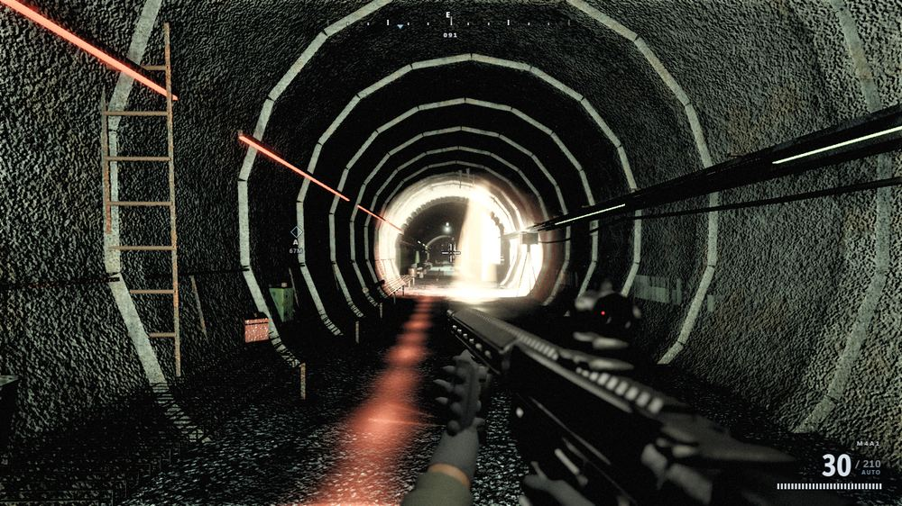
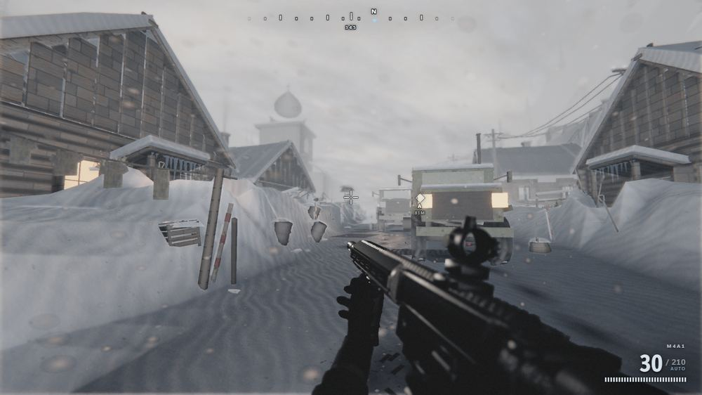
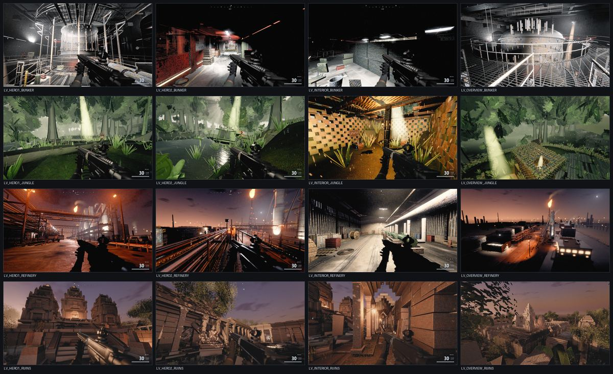

# OPERATION BLACKOUT

## A 157,000-line AAA-target FPS with zero art assets, built by orchestrated AI agents

*Technical write-up — architecture, methodology, findings, and applicability to future game development.*

---

# 1. Executive summary

**What it is.** A first-person shooter in the browser, built on Three.js r180, with **10 distinct levels**. It runs by double-clicking a single `index.html` — no server, no build step, no install, no package manager.

**What is unusual about it.** There is not a single image, 3D model, audio file or font anywhere in the project, and no network request at runtime. Every texture is synthesised from noise fields into a canvas, every mesh is built from code, every gunshot is layered oscillators and filtered noise through a procedurally generated impulse response, and the sky is an atmospheric-scattering integral evaluated into a lookup table.

**How it was built.** By fan-out orchestration: waves of parallel AI agents, each owning exactly one file, with adversarial critic agents grading rendered frames against a AAA bar and routing findings back to the owning module. Roughly 100 agent-runs across nine orchestrated workflows.

| Metric | Value |
|---|---|
| Game source | 156,859 lines across 36 JavaScript modules |
| Tooling | 1,616 lines of Python across 9 tools |
| Design docs | 1,138 lines of Markdown contracts |
| Levels | 10, each with a distinct time of day, weather, light source and palette |
| External assets | **0** |
| Runtime network requests | **0** |
| Build steps | **0** |
| Typical frame | 230–430 draw calls, 1.5–4.2M triangles |


*Level 1, Al-Bakr Market District. Every surface, the weapon, the sky and the atmosphere in this frame is generated from code at boot. No image, model or audio file exists anywhere in the project.*

## 1.1 Live demonstrations

Three recorded sequences. Stills cannot show the systems that matter most — weather, muzzle flash, recoil, and a lightning strike relighting a scene — so the engine has a record mode that steps a fixed timestep and captures each rendered frame.


*DEMO 1 — Firing, level 1. Procedural muzzle flash (star-shaped billboard, blackbody core, forward sparks, and a PointLight that briefly lights the world), spring-damped weapon recoil, shell ejection, and camera impulse. All animation is procedural; there is no keyframe data in the project.*


*DEMO 2 — Lightning, level 2. Rain streaks sheared by wind with depth parallax, wet ground holding reflections, and a multi-stroke lightning strike that is a real light casting real shadows rather than a screen fade. Thunder is scheduled afterwards at a delay matching the strike distance.*


*DEMO 3 — Blizzard, level 3. Snow is not recoloured rain: flakes tumble and drift, move far slower, are affected far more by wind, and vary in size with strong depth parallax. Whiteout haze swallows distance.*

---

# 2. The central technical decision: no traditional art assets

## 2.1 It began as a constraint, not a thesis

The target machine had **no Node.js and no npm**. That single fact cascaded:

- No npm meant no bundler — so no `import`/`export`, and the game had to ship as classic `<script>` tags.
- Shipping as plain scripts meant running from `file://`, which blocks `fetch`, `XMLHttpRequest` and ES modules entirely.
- No fetch meant **nothing could be loaded at runtime** — no textures, no models, no audio, no fonts, no CDN.
- No bundler also meant no asset pipeline: nothing to convert, pack, or preprocess anything.

The only remaining option was to generate every asset in code at boot. What started as a limitation turned out to have properties worth choosing deliberately.

## 2.2 What procedural generation actually bought

| Property | Consequence |
|---|---|
| **Distribution size** | The entire game is ~4 MB, of which 2.1 MB is the Three.js library itself. A comparable asset-based game is 10–100 GB. |
| **No pipeline** | No import, no packing, no LOD baking, no texture compression step, no asset server. Change a number, reload. |
| **Infinite variation** | A texture generator produces a family, not a file. Per-instance seeds give every container, every snowdrift, every rust streak its own variation at no storage cost. |
| **Parametric art direction** | Wetness, grime, edge wear and damage are *parameters*, so a whole level can be made wet, or a material aged, by moving one value. |
| **No licensing surface** | Nothing is derived from third-party assets, photographs or scans. |
| **Agent-authorable** | An AI agent cannot paint a texture or sculpt a mesh, but it can write the *code that generates them*. |

That last point deserves emphasis. **The choice of a code-based content representation is what made agent-driven development of a visually rich game possible.** Assets are opaque binaries to a language model; generators are source code, which is the medium it works in natively. The constraint and the method turned out to be well matched.

## 2.3 What it cost

An honest accounting:

- **Human faces and organic detail are hard.** Procedural characters read convincingly at conversational distance and poorly in extreme close-up. Photogrammetry wins decisively here.
- **Boot cost replaces download cost.** Texture generation is the single largest boot expense (~2.2 s single-threaded). The cost moved rather than disappeared.
- **Art direction becomes programming.** Changing a look means editing a generator, not repainting a texture — slower for a trained artist, faster for an agent.
- **Everything must be written.** With no `examples/jsm`, the post-processing chain, cascaded shadow maps, and decal system all had to be implemented from scratch.

---

# 3. Architecture

## 3.1 Hard constraints (the contract every module obeys)

| Constraint | Consequence |
|---|---|
| No Node.js / npm / bundler | Classic `<script>` tags, IIFE-wrapped modules |
| Runs from `file://` | `fetch`, XHR and ES modules are blocked |
| Zero external assets | All content generated in code |
| No `examples/jsm` | No EffectComposer, no `*Pass`, no OrbitControls, no BufferGeometryUtils |
| No `Math.random()` | Seeded RNG only, or captures stop being reproducible and the critic loop becomes worthless |
| Never throw from lifecycle methods | One exception blanks the screen for all 15 systems |

## 3.2 Vendoring Three.js as a classic script

Three.js r180 ships as ES modules split across `three.core.js` and `three.module.js`. A build step converts them into one classic script exposing `window.THREE`. Naive concatenation fails: both files declare colliding top-level helper names. The transform gives each its own function scope and re-injects the module's imports from the core's export object.

```js
(function () {
  'use strict';
  var __core = (function () { /* three.core.js body */
    return { Vector3: Vector3, Matrix4: Matrix4, /* ...425 exports */ };
  })();
  var __mod = (function (__core) {
    var Vector3 = __core.Vector3;        // 188 re-injected imports
    /* three.module.js body */
    return { WebGLRenderer: WebGLRenderer, /* ... */ };
  })(__core);
  window.THREE = { /* 422 public exports merged */ };
})();
```

## 3.3 Module registration and file ownership

Every file is an IIFE hanging itself off a single global namespace. No module declares a global.

```js
(function (GAME, THREE) {
  'use strict';
  class TextureLibrary {
    constructor(ctx) { this.ctx = ctx; }
    async build(ctx) { /* heavy generation, yields between chunks */ }
    update(dt, ctx) {}
  }
  GAME.TextureLibrary = TextureLibrary;
})(window.GAME, window.THREE);
```

**File ownership is the concurrency primitive.** Exactly one agent may write a given file in a given wave. This is the single most important rule in the whole methodology: it is what allowed 14 agents to write 35,000 lines simultaneously and have it integrate on the first attempt with zero errors. Cross-module communication happens only through documented APIs, and every call is defensively guarded so a missing or broken dependency degrades instead of cascading.

## 3.4 The context object and system lifecycle

A single `ctx` object is constructed by `main.js` and passed to every system. Systems are built in a fixed order, so a system may only depend on what was built before it.

```js
class System {
  constructor(ctx) {}      // cheap wiring only
  async build(ctx) {}      // heavy generation; may yield via GAME.yieldFrame()
  update(dt, ctx) {}       // per-frame simulation
  resize(w, h, ctx) {}     // viewport change
}
```

Boot order: textures → materials → sky → lighting → postfx → level → props → player → weapons → ballistics → vfx → weather → audio → ai → hud.

## 3.5 The level registry and declarative environments

This is the architectural change that made scaling from 2 levels to 10 tractable. Originally `Level` was a single hardcoded class, and every new level required edits to `sky.js`, `lighting.js` and `postfx.js` — which would have serialised eight parallel builds onto the same four files.

A level is now a `Level`+`Props` pair registered in a table, selected with `?level=<id>`, carrying a **declarative environment profile**:

```js
snowbound: {
  name: 'Kirovsk Pass',
  level: 'LevelSnowbound', props: 'PropsSnowbound',
  env: {
    timeOfDay: 0.30, sky: 'overcast', weather: 'blizzard', turbidity: 0.09,
    grade: 'cold', exposure: 0.15, lightRig: 'sun', interior: false
  }
}
```

`main.js` applies the profile after the build pass by calling existing public APIs — `sky.setWeather()`, `weather.setPreset()`, `postfx.setGradePreset()`, `lighting.setRig()` — each call individually guarded so an unimplemented preset is skipped rather than fatal. **Adding a level now requires zero shared-system edits.**

The two originally-shipped levels deliberately carry `env: null` and keep their legacy path, so they cannot be regressed by a profile change. An unknown or failed level logs clearly and falls back rather than blanking the screen.

## 3.6 Rendering pipeline (all hand-written)

With no `examples/jsm`, everything below was implemented from scratch on top of raw `WebGLRenderTarget`, `DepthTexture`, `ShaderMaterial` and a fullscreen triangle:

- **Composer** — ping-pong HDR render targets (HalfFloat), MRT for depth/normal/velocity
- **GTAO** — horizon-arc ambient occlusion with depth-aware bilateral blur
- **TAA** — Halton(2,3) jitter, velocity reprojection, YCoCg neighbourhood clipping, Catmull-Rom history
- **Bloom** — progressive downsample/upsample pyramid with tent filters, not a single gaussian
- **Volumetrics** — raymarched light shafts with blue-noise dithered offsets
- **Motion blur** — per-pixel velocity-buffer directional blur
- **SSR** — screen-space reflections with binary refinement, thickness testing and roughness-aware blur
- **Tonemap + grade** — AgX curve, then a 9-preset colour grade system
- **CSM** — PCSS cascaded shadows with texel snapping (without snapping, shadow edges crawl as the camera moves). Three cascades by default, four at most, and two on the harbor (`lighting.js:2235`, `:2261`)

---

# 4. Procedural content generation

## 4.1 The pipeline, end to end

Everything below hangs off one path from a seed to a lit frame. Nothing is loaded at
any step.

```
seed (integer)
  └─ GAME.RNG (mulberry32)  ──────────────────────────────┐
       │                                                  │
       ├─ GAME.Noise: perlin2, fbm, ridged, Worley ────┐   │
       │                                               │   │
  1.  TEXTURES  textures.js                            │   │
       │  per recipe: build a HEIGHT field first,       │   │
       │  derive normal / AO / roughness / albedo       │   │
       │  from it, pack Float32 → Uint8ClampedArray,    │   │
       │  upload as THREE.DataTexture                   │   │
       ▼                                                │   │
  2.  MATERIALS  materials.js                           │   │
       │  bind a map set to a MeshStandardMaterial,     │   │
       │  patch its shader chunks via onBeforeCompile   │   │
       │  (triplanar, stochastic tiling, RNM detail,    │   │
       │  POM, the vertex wear contract)                │   │
       ▼                                                │   │
  3.  GEOMETRY  level_*.js / props_*.js  ◄──────────────┘   │
       │  bevelBox / cyl / revolve / reliefBox atoms,       │
       │  assembled by a Builder that sorts every piece     │
       │  into a per-material bucket                        │
       │                                                    │
  4.  VERTEX PAINT  ◄───────────────────────────────────────┘
       │  write grime / wetness / edge-wear into the
       │  geometry's colour attribute — the dirt is here,
       │  not in any texture
       ▼
  5.  BATCH  Geo.mergeAll per bucket + InstancedMesh per repeated kind
       ▼
  6.  LIGHT + POST  lighting.js (PCSS CSM, 3 cascades) → postfx.js
          (GTAO, TAA, bloom pyramid, volumetrics, grade)
```

Steps 1–5 run once at boot and are deterministic: the same seed produces the same
bytes. Step 6 runs every frame.

## 4.2 Noise, randomness and determinism

`GAME.Noise` (`src/core/util.js:128`) is the basis for every texture, every mask and
every geometric perturbation in the project. `perlin2` is a classic gradient lattice
with **period exactly 256** — a fact that matters in §4.4, because two comments in the
codebase get it wrong.

Randomness is `GAME.RNG`, a mulberry32 seeded from an integer. **`Math.random()` is
banned project-wide**, and the ban is load-bearing rather than stylistic: the entire
verification method depends on a capture being reproducible, so that two captures a
round apart differ only by the change under test. One unseeded call anywhere in a
level's build would make every A/B in §4.16 meaningless. The ban is checked by review
rather than by tooling, which is a real gap.

Generation is **CPU, not GPU**. `textures.js` contains no `createElement`, no
`getContext` and no shader: each map is computed into a `Float32Array` plane, packed
into a `Uint8ClampedArray`, and uploaded as a `THREE.DataTexture`. Canvas 2D *is* used
for texture work, but only where a rasteriser is genuinely the right tool —
`level.js`, `level_bunker.js`, `level_boneyard.js`, `level_refinery.js`,
`level_ruins.js`, `props_refinery.js`, `props_ruins.js`, `props_snowbound.js`,
`ai.js`, `weather.js` and `scenarios.js` — for lettering, signage, marks and faces.
Earlier revisions of this document and of `ARCHITECTURE.md` both described the library
as canvas-based. Both were wrong; both are now corrected.

## 4.3 The height-first texture pipeline

The design decision that makes procedural PBR work at all is **height-first**: author
one height field, then derive every other channel from it. Maps that share an origin
cannot disagree with each other, and the correlation is what makes wear read as
physical rather than painted.

In the order the code runs it:

1. **Base tone** — large-scale fbm so nothing is ever a flat colour.
2. **Material structure** — the recipe's actual subject. Worley cells for aggregate,
   ridged noise for cracks, sheared fbm for directional streaks, explicit lattices for
   brick and tile.
3. **The wear pass, driven by the height field** — grime accumulates where height is
   *low*, edge wear appears where height is *high*. This is the step that would be
   hand-painted in a conventional pipeline, and it is the one that most rewards being
   derived instead.
4. **Normals by Sobel differencing** of the height field.
5. **AO by cavity approximation** — sampling height over a neighbourhood, not merely
   inverting it, so a broad shallow dish does not read as a hole.
6. **Roughness varying spatially**, telling the same story as the height: polished
   where traffic has burnished, matte where it has not.

A `bump` dial per recipe targets a mean slope of 0.42 so that a recipe cannot quietly
ship at ten times the relief of its neighbours, and an opt-in `deband` pass flattens
rank-1 row and column means where an axis-aligned generator has left banding.


*The material test chart — a first-class capture scenario showing every generated material as a lit sphere and a flat plate. This chart is how library-wide failures get caught: a specular test across these spheres revealed that NOT ONE material in the entire build produced a highlight, because roughness floors had been clamped.*

## 4.4 Tileability, the Nyquist clamp, and a seam the comments deny

**Tiling.** Noise is sampled on a torus — the sample coordinate wraps, so the field is
periodic by construction rather than by mirroring or by blending a border.

**The Nyquist clamp.** Differentiating a height field whose features approach one texel
produces sparkling confetti normals, so requested frequencies are clamped to
`maxFreq = floor(size/3)` and Worley cell counts to `maxWorleyCells = floor(size/5)`.
At the `high` preset that is 341 and 204 for a 1024 tile, 170 and 102 for 512, 85 and
51 for 256.

The clamp is silent, and that has consequences worth knowing about. `genPaintedMetal`
requests an "orange-peel" layer of 2 octaves at frequency 340; on its 512-pixel tile
that executes as a **single** octave at 170 — a three-texel period. Its neighbour
requests 380 across 5 octaves and executes as 170, 340, 680… all clamped. Neither
comment mentions it.

**A seam the code's own comments deny.** The two masonry recipes carry the claim that
"every frequency is a power of two so the perlin lattice (period 256) wraps exactly."
This is false twice over. The frequencies actually used are 48, 24, 26, 6, 5, 40, 12,
14 and 28 — none is a power of two. And because `perlin2`'s period is exactly 256,
wrapping a unit interval requires the frequency to be a **multiple of 256**, so 32, 64
and 128 would not have wrapped either. Measured discontinuity across the affected
layers is 0.092 to 0.211 mean, reaching 1.000 at worst. A sibling comment claims
"seamlessness is structural, not tuned" — true of the *layout*, whose course heights
and stone widths are normalised cumulative sums, and not true of the eight noise layers
laid on top of it.

Whether the seam is *visible* in a rendered frame is **undetermined**: these defs are
triplanar with a warp, which may hide it. It is recorded here rather than quietly
fixed because it is the exact failure mode this document warns about in §4.7 — a
confident comment standing in for a measurement.

## 4.5 The texture recipe catalogue

Forty-five recipes live in `textures.js`, plus two more generated in `materials.js`.
Each resolves to a pixel size through a tier, so a quality preset changes resolution
without changing any recipe:

| tier | high | medium | low | recipes |
|---|---|---|---|---|
| `hero` | 1024 | 512 | 512 | 7 |
| `std` | 512 | 512 | 256 | 35 |
| `small` | 256 | 256 | 128 | 3 |

Only seven recipes are `hero`, and `hero` is 1024 only at the `high` preset — so the
market boots five 1024 sets and the harbor seven, not the "20+" an older comment
claims. At `medium` and `low`, nothing is 1024.

The market and shared set (28 recipes) is prebuilt for every level; the harbor set (17)
is prebuilt only when `ctx.levelId === 'harbor'`, so any other level that asks for a
harbor-set name pays a synchronous hitch. That is a real wart.

| # | recipe | tier | what it synthesises |
|---|---|---|---|
| 1 | `concrete` | std | poured slab: exposed aggregate, air pockets, cracks, trowel zones |
| 2 | `concrete_wall` | hero | 7 formwork boards, broken butt joints, clustered blowholes, honeycomb, form-tie holes |
| 3 | `plaster` | hero | lime skin over grey render: map-crack plate network, plate loss, spall craters, trowel chatter |
| 4 | `brick` | hero | running bond, 12 courses × 4, per-course offset, spalled faces, knocked arrises, repointing |
| 5 | `asphalt` | hero | bitumen with two chip sizes, wheel-path polish, tar repair patch, oil stain |
| 6 | `sand` | std | two interfering wind-ripple trains, drift depth, grain sorting, pebbles |
| 7 | `dirt_ground` | std | packed dirt, dried-mud plates, curled plate edges, vehicle ruts |
| 8 | `gravel` | std | three stone sizes over void fines |
| 9 | `rubble` | std | faceted demolition fragments, rebar, pulverised dust |
| 10 | `stone` | std | quarried limestone: chisel banding, solution vugs, fossil shell, bedding planes |
| 11 | `rusted_metal` | std | three-stage oxide over mill scale: bloom, flaking scale, pitting, zoned scratches |
| 12 | `corrugated_metal` | std | 6 sine waves, zinc spangle, trough rot, fastener rows |
| 13 | `painted_metal` | std | industrial enamel over red-oxide primer over bare steel, orange-peel |
| 14 | `wood_plank` | std | 5 planks, butt boards, annual rings as cathedral arches |
| 15 | `fabric` | std | market awning: irregular plain weave, 5 faded stripes, holes |
| 16 | `cloth_canvas` | std | cotton duck twill, olive↔tan dye drift |
| 17 | `sandbag` | std | open hessian weave with sand bleeding out and down |
| 18 | `cloth_olive` | std | militia ripstop, olive dye lot |
| 19 | `cloth_tan` | std | the same at a different pitch and dye lot |
| 20 | `tile` | std | glazed terracotta: 4×4 lattice, jittered joints, per-tile glaze |
| 21 | `plastic` | std | moulded PP: spark-eroded mould grain, flow lines, UV chalking |
| 22 | `gun_metal` | hero | parkerised aluminium: phosphate mottle, bead-blast peen, broach striations |
| 23 | `gun_polymer` | std | glass-filled polymer: moulded checkering, stipple, parting line |
| 24 | `skin` | std | face and hands: pores, crossed creases, freckles, capillary flush, stubble |
| 25 | `rubber` | small | pebbled mould skin, ozone perishing cracks, antiozonant bloom |
| 26 | `glass` | small | float waviness, dust film, wiper smears, rain spots |
| 27 | `foliage` | std | **alpha-cut leaf atlas**, 340 leaves in two size classes |
| 28 | `detail_normal` | small | tiling micro-relief overlay, **normal only** |
| 29–32 | `container_steel`, `container_red/blue/green` | hero/std | container flank in four liveries |
| 33 | `ship_hull` | std | welded plate, weld beads, boot topping, antifouling, waterline growth |
| 34 | `wet_concrete` | hero | dock slab flooded to a local water table |
| 35 | `dock_concrete` | std | dry quay slab: cool aggregate, sealed expansion joints, tyre arcs |
| 36 | `corrugated_roof` | std | box-profile sheet: spangle, pan rot, algae, bleeding fixings |
| 37 | `deck_plate` | std | rolled chequer plate, capsule lugs on a jittered 7×7 grid |
| 38 | `steel_grate` | std | serrated bearing bars and cross rods, **alpha-tested** |
| 39 | `chainlink` | std | galvanised diamond mesh, interlocked, **alpha-tested** |
| 40 | `tarpaulin` | std | PVC-coated fabric: buried scrim, sag ridges, hard folds, mildew |
| 41 | `rope` | std | laid 3-strand rope, one full lay per tile, counter-twisted yarns |
| 42 | `rubber_fender` | std | embedded grit, contact-band scuffing, paint transfer |
| 43 | `reefer_panel` | std | 9 louvre blades in a painted casing, condensation runs |
| 44 | `painted_line` | std | thermoplastic marking worn through to cool concrete, glass beads |
| 45 | `sea_water` | std | harbour water at night: swell, chop, capillary, rain dimples |
| +2 | `masonry`, `masonry_rubble` | — | coursed rubble under a spalled lime render (generated in `materials.js`) |

Three worked examples, because the interesting part is the *reasoning* rather than the
list:

**`concrete_wall`** models formwork rather than concrete. Seven horizontal boards; the
butt joint is `smoothstep(0.042, 0, min(bf, 1-bf)) * smoothstep(0.34, 0.66, jointN)`,
which makes the joint line **vanish over half its length** — a continuous scribed line
is the tell that gives away a generated wall. Board tone comes from an fbm *along* the
board rather than one constant per board. Blowholes are Worley cells gated by a density
field, so they cluster instead of distributing evenly, and the four form-tie holes are
placed by the RNG rather than on a lattice.

**`plaster`** is a cell-*plate* model, not a cell-*border* model. Plates are lost by
`smoothstep(0.855, 0.925, plateA.id) ∧ smoothstep(0.885, 0.945, plateB.id)`, so losses
cluster and stay under about a tenth of the tile; the crack network comes from the
Worley F2−F1 difference gated by a crazing zone and a breaker term, so cracks stop and
start instead of running everywhere. Spall craters write into a shared mask which a
second pass then repaints as exposed render — the crater and the material revealed
inside it cannot disagree, because one produced the other.

**`brick`**'s `[4, 12]` lattice is load-bearing beyond this file: `materials.js`
quantises its stochastic tiling offsets to it, so a random offset lands on a brick
boundary rather than slicing a brick in half. Brick lengths are jittered then
renormalised to preserve the course pitch. Roughly 6% of faces spall, and each brick
gets a firing gradient at its own angle.

## 4.6 Material assembly: shader injection over stock Three.js

A material is a `MeshStandardMaterial` whose shader is patched through
`onBeforeCompile`, with `customProgramCacheKey` isolating each distinct feature
combination so Three.js does not silently share a program between two different
configurations. The market frame runs **95 programs** for 143 textures and 127
geometries.

The distinction that readers most often miss: a **texture recipe** (§4.5) produces a
map set. A **material def** binds a map set to a shader configuration. The same
`concrete` recipe reaches the frame very differently depending on which def asks for
it.

The injected techniques:

- **Reoriented normal mapping** blends a high-frequency detail normal over the base
  normal. This is what stops surfaces reading as plastic at close range, and it is
  correct rather than additive — the detail normal is rotated into the base normal's
  frame instead of being summed with it.
- **Stochastic tiling** — variance-preserving per-tile offset and rotation, to break
  lattice repetition without the mean or variance of the map drifting.
- **Whiteout triplanar** — world-space projection with per-axis sign correction, so a
  wall and a floor cut from the same material share a scale and neither stretches.
- **Parallax occlusion mapping** — stepped, using `textureGrad` so the derivative is
  correct under the offset UV, distance-faded.
- **`alphaLod`** — an anisotropy-driven mip bias applied *to the alpha cut only*, so
  the coverage decision is band-limited while albedo and normal keep their anisotropic
  sharpness. Alpha-tested grating and chainlink are what motivated it.
- **`grain`** — whole-octave decimation of the base map set, reducing its own
  high-frequency content without changing world scale. It costs nothing at runtime and
  *reduces* VRAM, since a 1024 set at low grain becomes a smaller set.
- **`worldTile` / `uvScaleForWorld`** — solve the UV from a world size rather than a
  texel density. Without it, a locally-authored map whose features are sized in metres
  (hazard striping, lane markings, barrier tape) silently gets the library's texel
  figure and renders as a flat colour. That was a real bug and it is invisible to
  review.
- **Water** carries an opt-in planar reflection: a mirror camera, an oblique near-plane
  clip, a half-resolution float target. Its `graze` default moved from 0.5 to 0.30
  after measurement, because `graze` hands the surface to the *absolute* brightness of
  the reflected world at grazing angles, and on a level whose far bank is dark — a
  closed jungle canopy, a night harbour — that makes the water darker than authored.

## 4.7 The spatial frequency bands, and the one that is mislabelled

Three bands are meant to cover three scales: a **macro** tint, a **meso** surface band,
and a **detail** micro layer. `materials.js` has always described `mesoScale 1.82` as
"the 0.1–0.6 m surface band."

It is not. 1.82 tiles per metre is a **0.55 m tile**, and the band a tile delivers is
set by the tile's *content*, not by the tile's size: the recipe inside it has its own
features at a few hundredths of the tile, so 1.82 actually delivers roughly **4 mm to
1.7 cm** features. It is a second micro layer, sitting almost on top of the detail
layer it was supposed to bridge to.

The consequences were expensive and took four rounds to surface. Three separate levels
reported that the 0.1–0.6 m band was unreachable — they were all reaching for
`mesoScale`, which could not deliver it. Two of them independently diagnosed the
resulting near-field artefact (called "television static" on one level and "popcorn" on
another) as grazing incidence on micro-relief, *after* an earlier round had tried
halving the amplitude and found the measurement never moved. Both were right about the
mechanism; neither could reach the band that would have fixed it.

Compounding it, `mesoScale`, `detailCavity` and `detailRough` all existed and were
**undocumented** — absent from the file's own header options list and from `DEFS`. The
single highest-value knob in the material library was invisible to anyone reading the
documentation, and mislabelled for anyone reading the comment.

This is the most instructive bug in the codebase. Not because a number was wrong, but
because a *comment* was wrong, and comments are what agents read when deciding which
parameter to reach for.

## 4.8 Geometry atoms and the bevel doctrine

`Geo.bevelBox` (`util.js:612`) is the atom under nearly everything. It builds a
`BoxGeometry`, then for each vertex counts how many of its components sit on a half
extent and, where that count is two or more, insets each extreme component by the bevel
amount.

**At the default `seg = 1` it does not produce a chamfer at all.** Every one of the 24
vertices is a corner, so all three components move, and the result is *exactly*
`BoxGeometry(w−2b, h−2b, d−2b)` — a box that is 2·bevel smaller on every axis, with no
new facet and no new highlight. That is why `padBox`/`padBoxR` exist: they add back
what the "bevel" removed. A genuine chamfer needs `seg = 2`, which turns each face into
a shallow pyramid and costs 48 triangles against 12.

Triangle costs are worth stating plainly, because the draw-call budget in §4.10 is
spent in these units: `bevelBox` is 12 triangles at `seg 1`, 48 at `seg 2`, 108 at
`seg 3`. `cyl` is `4 × segments` capped and `2 × segments` open.

**`cyl` builds a capped cylinder**, and four levels expose no way to open it. A capped
cylinder used as a rim, a bezel or a reflector is a solid disc seen face-on — which is
exactly how one level's headlamp cluster kept photographing as two flat pale circles
however carefully the bowl behind them was modelled. The same file records the sibling
lesson: the default segment count was 8, so every pipe, pole and conduit in a station
was an octagon, plainly faceted on a 5.6 cm grab pole at 1.5 m. That level's default is
now 14, and the geometry cache is keyed on segment count so the cost stays bounded.

**The bevel doctrine** is a five-entry quantised table, `[0.013, 0.022, 0.034, 0.048,
0.066]` metres, sampled per block so a wall's arrises range from dressed-and-sharp to
eaten-away without multiplying the geometry cache by the number of blocks. Both of its
limits were set by measurement after a failure:

- The table's top entry used to be 9.5 cm. Two adjacent blocks then put 19 cm of
  chamfer into one joint, and photographed at 1.5 m the coursing read as *a stack of
  shelves with black slots between them* rather than as ashlar. Pulled to 6.6 cm.
- `reliefBox` — per-vertex displacement hashed off the vertex's own local position, to
  give differential erosion as shape rather than as texture — was first authored at a
  5.2 cm scale. A chipped corner then lost 19 cm and an eaten arris 12 cm; at 60 cm
  viewing distance two adjacent blocks put a third of a metre of void into one joint.
  Measured back down to a 4 cm dish.

The general lesson, and it recurs: relief that reads correctly at 20 m opens holes at
60 cm, so the magnitude has to be chosen against the *closest* distance the surface is
ever photographed from, not the average.

## 4.9 The grime is on the vertices

This is the highest-leverage decision in the project and it is worth stating as
plainly as possible: **the dirt is not in a texture.** It is painted into the geometry's
colour attribute, per vertex.

The contract is that **white is pristine**, and each channel is read as a subtraction:

```glsl
gbGrime = 1.0 - vColor.r;   // dirt, soot, staining
gbWet   = 1.0 - vColor.g;   // standing water, spray, rain
gbWear  = 1.0 - vColor.b;   // edge wear down to substrate
```

The shader consumes them in a fixed order. Grime mixes albedo toward a grime colour
scaled by the surface's own luma, then darkens it. Wear mixes toward a *pale* substrate
— the default wear colour is `0x9aa0a6` on metals and `0xb9ae9a` otherwise — so the
`B` channel brightens, because a worn edge exposes bright metal or bare stone. Wetness
multiplies albedo by `0.48`, collapses roughness toward `0.09` and raises specular
`F90` to `1.0`. Those last three are per-def rather than global — `wetDark` is 0.48 on
most surfaces and `wetRough` runs 0.085 to 0.115 depending on what the surface is, so a
wet flagstone and a wet steel plate do not converge on the same gloss.

**The consequence that matters, and that took a round to learn: the mesh tessellation
is the resolution of the dirt.** Because grime and wetness live at vertices, a surface
can only draw a stain as finely as it is tessellated. One level's platform deck was
refined from 0.55 m cells to 0.26 m — not for its silhouette, which is flat, but
because the flood's shoreline is a wetness mask and 0.55 m cells cannot draw a
shoreline. Cell size is an art decision wearing a geometry decision's clothes.

Ground-contact darkening shows the same idea and one more subtlety. Props publish
`{x, z, r}` occluders; the ground accumulates a **max** mask over them rather than
multiplying, specifically because two props a metre apart would otherwise compound and
punch a hole in the snow between them — so the mask is rewritten from a saved base
colour each time rather than from its current value. The ring is anisotropic, scoured
on the lee side and banked on the windward side, so it is not a circle. And it is
blue-driven: red loses nearly twice as much as blue, because what is being removed
under a prop's foot is the sky's own cool light. Its resolution is the ground field's
0.50 m cell, so a 0.22 m occluder still draws a 0.5 m ring — the same cell-size limit
again.

Two further refinements are worth recording because both came from a critique. Masks
can be authored in an object's **own** local or cylindrical frame, which is how a
reactor vessel gets rust weeps falling out of its head-flange stud ring rather than
streaks running down a world axis. And the card-wear term is **normal-gated**: it
originally looked only at height, so a poster lying flat on the ground took the same
wear as one hung at eye level, and the fallen hoarding in one level photographed as
something somebody had put down that morning.

The payoff was unplanned. When a rain level was added much later it got physically
correct wet PBR essentially for free: levels already painted wetness into vertex
colours, and nobody had to invent a parallel system. A per-instance modulation
multiplies the mask, so a hundred instances of one crate carry a hundred different
amounts of dirt from one geometry.

## 4.10 Batching and the draw-call economy

Here are the real numbers, measured from `renderer.info.render.calls`, which is what
`main.js:625` reports:

| | market street | harbor quay |
|---|---|---|
| draw calls | **422** | **270** |
| triangles | 4,201,372 | 2,047,292 |
| shader programs | 95 | — |
| distinct geometries | 127 | — |
| textures | 143 | — |

Across all ten levels the signature framings run **186 to 482** draw calls. The project
budget is roughly 500 draw calls and 4.5M triangles per framing, and `props.js`'s own
header sets its share at "**< 80 draw calls for ALL props**."

That 422 is not the number of objects in the scene. It counts every pass, and the scene
is drawn several times before post-processing — the shadow rig is a cascaded PCSS
CSM — three cascades by default, four at most, two on the harbor
(`lighting.js:2235`, `:2261`) — and each cascade re-submits every shadow-casting
object, after which the
post-processing chain adds its own fullscreen passes for GTAO, the bloom pyramid,
volumetrics, TAA and grade. The scene-graph figure is the **127 distinct geometries**.

**The architecture.** Everything repeated goes through `InstancedMesh`; everything
one-off is merged per material by `Geo.mergeAll` into a handful of static batches. A
`Builder` sorts each piece into a per-material bucket as it is created, so batching is
not a post-process — it is how geometry is written in the first place. `Batch` wraps an
`InstancedMesh` with `count = 0` and counts up as instances are placed, always writing
a colour (an unwritten `instanceColor` entry risks a black instance depending on
Three.js's fill policy), and disposing itself if nothing was placed. `Combo` is N
parallel batches sharing one matrix, for a prop that needs several materials.

**The accounting is deliberately pessimistic.** `props.js` does not trust the budget it
set itself; it counts draws by walking its own scene graph and treating every
`isMesh || isPoints` under its root as one call.

**The payoff, stated as a measurement.** Rounds 3 and 4 added 84% more triangles to one
level and 59% to another while draw calls moved by **+2 and 0**, because the new
geometry went into buckets that already existed. Adding detail without adding draw
calls is the whole technique, and it is why the triangle budget is the one that binds.

**One failure mode is silent and worth knowing about.** `Batch.add` returns `false` past
its capacity and the caller has no idea, so a saturated batch simply stops placing —
the last pass built gets nothing. Two levels therefore count saturated batches and dump
them under a URL flag, because there is no other way to see it.

**And one thing that does not work.** The only real attempt at instance culling uses a
2×2 chunk grid over a 120×124 m level. The reasoning was sound — one `InstancedMesh` per
kind is one bounding sphere per kind, and a bounding sphere around the whole level is
never outside the frustum, so every grass clump in fifteen thousand square metres was
being submitted in the main pass *and* in every shadow cascade. But the chunks are
60×62 m, giving a 43 m half-diagonal, so their bounding spheres are almost never
outside the frustum either and essentially nothing is rejected. That level pays for all
of its geometry in every framing and sits at 96% of the draw cap with no headroom left.
Genuine distance-banded culling, or a level-declared chunk count, would be worth more
to it than any further art work.

Build-time LOD exists in exactly one place — one level's conifers — and nowhere else.

## 4.11 How a level assembles itself

`main.js` holds an ordered `SYSTEMS` table of fifteen entries and `await`s `build()` on each in turn: textures, materials, sky, lighting, postfx, level, props, player, weapons, ballistics, vfx, weather, audio, ai, hud. `level` is the sixth entry and `props` the seventh, and that placement fixes two facts a level author cannot argue with. Sky, lighting and postfx are **already built**, so a level cannot influence the first transmittance LUT, the first PMREM or the first shadow cascade from its own `build()` — only through the declarative profile, which `sky.js` reads for itself. And `props.build()` does not begin until `level.build()` has fully returned, which is why the dressing pass may assume `level.anchors`, `level.colliders` and `level.cameraPoses` all exist.

Class names resolve through the registry rather than being fixed: for `key === 'level'` the loop reads `levelDef.level`, for `props` it reads `levelDef.props`. A class that failed to load is logged and skipped; a `build()` that throws sets `ctx[key] = null` and boot continues. `resolveLevel()` falls back to the market both for an unknown id and for a registered id whose module never loaded — a missing level must not blank the screen.

### The stage sequence

Inside a level, `build()` is a flat list of `stage(name, fn)` calls. `stage` is four lines — a `try`/`catch` routing into `GAME.logError('metro.' + name, e)` — and it is why one broken feature costs one feature rather than the whole level. `await GAME.yieldFrame()` separates the groups so the loading bar paints. Line 4 — Zarechnaya runs seventeen stages in seven groups with six yields; Bayon Ruins uses eight.

| Group | Metro stages | What the group produces |
|---|---|---|
| 1 | `platform`, `arcade` | the station deck, coping, tactile studs, piers, arches, cornice |
| 2 | `vaults`, `endwalls` | three coffered vaults, the vent shaft, the collapse, two arched end walls |
| 3 | `trackhalls`, `tunnels` | ballast, sleepers, rails, conductor rail, both running bores |
| 4 | `train`, `escalator` | three cars and a shed bogie; the escalator hall, barrel and three lanes |
| 5 | `lighting`, `water`, `ceilings` | fittings + `practicalLights` + `lightShafts`; flood sheet, ponds, tide lines; synthetic ceiling colliders |
| 6 | `merge`, `emitters`, `fill` | `_finalize()`; one InstancedMesh of emissive fittings; the level-owned hemisphere |
| 7 | `nav`, `spawns`, `broadphase` | navgrid, spawn points, the collider spatial hash |

Nothing is a `THREE.Mesh` until group 6. Every stage writes into one `Builder` — a transform stack plus a null-prototype map from material key to an array of `{geometry, matrix, tags}` entries — and into `this.colliders`. Geometry atoms are cached by dimension in a `Map` keyed on `w.toFixed(3) + ',' + h + ',' + d + ',' + bevel`, which is what makes tens of thousands of `B.box` calls affordable and also why `Geo.mergeAll` must transform vertices out rather than reference geometry: many entries share one `BufferGeometry`. `_finalize()` merges each bucket, assigns world-space UVs, clones `uv` to `uv1` for the AO map, writes the per-vertex wear mask, and creates exactly one `Mesh` per material key. The module claims roughly 20 draw calls for the whole station; that figure is the module's own and was not re-measured for this document.

Five orderings are load-bearing, and each is visible in the sequence above:

- **All geometry stages precede `merge`,** because they are the only writers to the buckets. `buildLighting` and `buildWater` are geometry producers as well as publishers — housings, glint cards, tide bands — so they cannot run after it.
- **Every `addCollider` call precedes `nav`,** which rasterises `this.colliders` into the walkability grid.
- **`broadphase` is last of the three,** because it assigns `c._id = i` and inserts into the `SpatialHash`. A collider added after it is invisible to `raycast()`.
- **In ruins, `gallery` and `fixtures` precede `lights`.** `buildGallery` *returns* the roof-hole table and it is stored as `self._holes`; `buildFixtures` sets `self.fix`. `_buildLights` publishes two of its four `lightShafts` from the first, and every one of its `practicalLights` from the second — each lamp is pushed only if the matching fixture coordinate exists.
- **In the market, the instanced kerb-and-paving pass runs after `_finalize`,** because it creates `InstancedMesh` objects rather than writing into the buckets and would otherwise be merged away.

The geometry caches are disposed and cleared at the end of `build()`, which is safe only because `mergeAll` copied the vertex data out.

### The build-order race

`lighting.js` bakes a sky-visibility volume that must exist before any material compiles, so it is chained onto `scene.onBeforeRender` rather than called from `update()`. That means it can fire **during the loading sequence** — before the first `update()` has read `level.lightRig` or `level.practicalLights`. The bake is also what runs `_anchorPracticals`, `_clampPracticals`, `_buildRigBeams` and `_buildLampVisuals`, all four of which iterate `this.practicals`.

Probed on two levels with identical code paths, the outcome differed: the refinery reached the bake with 24 practicals (24 bulbs, 44 halos) and the jungle reached it with none, because the jungle takes longer to build and a loading-screen render lands inside its build. A level therefore got its emissive bulbs and additive halos — which `lighting.js`'s own header calls mandatory — or did not, depending on how many frames its geometry took to generate. The same race had already been caught silently discarding shaft fields: an injected `lightShafts[i].land` was present on the jungle level object while all six built shafts carried `land 0`, because `_buildShafts` had already run.

The fix is ordered and only half-applied, deliberately. `_adoptLevelRig(ctx)` is now called unconditionally immediately before the bake — provably a no-op today, since it returns on its first line unless the level is declarative, and grepping all ten level modules for `lightRig` finds exactly one publisher, `level_highrise.js:5101`. `_adoptLevelPracticals(ctx)` is called there **only** when `this._declarative && this._volBudget().practicalsEarly > 0`. Winning the race is not neutral: it also moves anchored lamps, pushes lamps out of geometry, and applies an enclosure boost of up to 1.55× output. Switched on for the boneyard, it changed the signature frame at *identical* draw calls and triangles (407 / 1,943,474) — a real lighting change to a level that had already been graded.

The consequence is worth stating plainly: `practicalsEarly` defaults to 0, the only per-level volume entry in the table is `bunker: {beams: 16, beamGain: 8.0, shaftMin: 1.6}`, and no level sets it. **The practicals half of the race is still open for all ten levels.**

### The published contract, and who consumes each part

| Published | Built when | Consumed by |
|---|---|---|
| `root` | `build()`, added to `scene` at the end | the scene graph |
| `colliders` | throughout | player capsule sweep; ballistics hitscan; `ai.js`'s own SpatialHash and up to 400 cover points; `lighting.js`'s ~0.5 m occupancy raster |
| `spawnPoints` | `spawns` stage | ai, scenarios, props keep-out |
| `navGrid` | `nav` stage | `ai.js` A* `PathFinder`; `scenarios.walkable()` |
| `cameraPoses` | after the geometry | `scenarios.js` framings; postfx DoF focus; `lighting.js` lamp anchoring; props sightlines and keep-out; audio |
| `anchors` | **the constructor** | props placement, `lighting.js`, `sky.js` |
| `lightShafts` | the level's lighting stage | `lighting.js` spot + haze cone, and its pairing audit |
| `practicalLights` | the level's lighting stage | `lighting.js` `_adoptLevelPracticals` |
| `sampleGround(x, z)` | analytic, always available | props, poses, navgrid, the wetness pass |
| `raycast(o, d, maxDist)` | `broadphase` stage | ballistics, props ground probes, scenarios occlusion tests |

`anchors` is built in the **constructor** in both worked examples, and the reason is written down as a rule: *nothing derives a position from a camera pose.* Every anchor field is derived from the same constants the geometry is (`A.arcadeN.piersX = PIERS_X.slice()`), so an anchor and the thing it names cannot drift apart, and props can survey the level without waiting for `build()`. `level_ruins.js` records the failure that motivated it — the harbor build put fixtures in corridors that had been moved out from under them. `props_metro.js` additionally carries a fallback copy of every anchor it reads, explicitly so that a level which failed to build does not take the dressing pass down with it, and explicitly *never as a source of truth*.

**None of this is enforced.** `check.py` loads one module at a time into headless Chrome and reports whether the expected `GAME` class is defined and whether the page threw; its report object initialises `constructed` and `built` to `false` and never writes either, and the pass criterion is `defined && !errors`. Nothing in the tree checks that a level publishes `cameraPoses.hero1`, `anchors`, `navGrid`, `sampleGround`, `raycast` or `practicalLights`. The only runtime enforcement is four log sites: `lighting.js` warning once when a rig with a lamp floor receives no `practicalLights`, its shaft-pairing audit, `scenarios.js` logging a missing pose key, and `sky.js`'s schema check on the `env` bag. All four write into `GAME.errors`, which the capture harness surfaces in `document.title` — that is the actual feedback loop.



*Line 4 — Zarechnaya. Every surface in this frame comes out of one `Builder`: three coffered vaults swept along X with analytic normals, arcade piers with segmental arch heads and voussoir rings, a platform deck generated from an analytic height field, and a flood sheet whose waterline is gated on that same field. The signage is an invented alphabet drawn stroke by stroke onto a canvas atlas — there is no font in the project.*

### Architectural generation: a station

Metro's masonry is four generators, each with a stated failure mode.

`sweepX(profile, x0, x1, nx, hole, jitter)` lofts a 2D profile in the ZY plane along X. Per-point normals are **central differences** of the profile, not face averages: the header states why, and it is a real perceptual argument — face-averaged normals give a visible facet band under a raking strip light because the eye reads the second derivative of the shading. A `hole(xMid, zMid, yMid)` predicate returning true drops that quad, which is how the vault gets its collapse and its vent shaft with no CSG. Getting the winding backwards is a silent failure: the frame has no ceiling in it. The platform vault sweeps its profile at 84 divisions over 340 steps along X; the track hall vaults at 40 over 280.

`vaultProfile` uses `s = pow(sin(PI*t), 0.80)` rather than a pure sine, because a pure sine springs at 36 degrees and reads as a shallow dome; 0.80 stands the springing near-vertical where it meets the arcade cornice. `cofferedVault` then builds a caisson field as three parts rather than battens on a shell: one **continuous** offset shell (so a punched rib opening can never leak), the proud rib grid as explicit overlapping bands (which is what solid plaster does), and per-cell reveal returns whose 3×3 aperture sample is discarded entirely if any tap lands inside a hole, so the returns of a half-cut coffer never hang out over the collapse.

`archedWall` rasterises an elevation into 0.22–0.25 m columns, raises each column's base to `ySpring + sqrt(r² - d²)` inside a hole, and **coalesces runs of equal height into one box**: a 19.6 m end wall with two tunnel portals costs about a dozen boxes instead of eighty. Its collider twin is not tidiness. `lighting.js` rasterises `level.colliders` into the occupancy grid that its sky-visibility bake and its shaft solver both walk, so one solid box across the east arch would report the arch as filled and the shaft supposed to spill through it would be discarded without a word. The same argument produced the ceiling colliders and, more pointedly, made the vent shaft **four wall colliders rather than one solid box**: the first version filled the shaft, `_solveShaft` reported the published shaft as buried in concrete and discarded it, and the beam the whole hero framing is composed around silently did not exist.

`archRing` places voussoirs from the chord/rise relation `r = (h² + f²) / 2f`, solved once for the arcade: `ARC_R = (1.70² + 0.70²)/(2 × 0.70) = 2.4143`, `ARC_CY = 2.95 + 0.70 − 2.4143 = 1.2357`, `ARC_SPAN = asin(1.70/2.4143) = 0.7789` rad. The ring is what makes an arch read as an arch at eight metres, and it is also what hides `archedWall`'s 2–3 cm column stepping.

Underneath all of it is one analytic ground field, and it is the single most useful structural idea in the file. `platY`, `trackY`, `tunnelY` and `escTreadY` compose fbm bands, a 1.22 m slab-joint depression, a drainage fall to both platform edges, a ponding trench along the wreck and a flood basin over the western third. The `deck()` generator samples that field on a lattice, takes normals as central differences of the samples, and treats a value of `-999` as *no surface here*, dropping any quad with a dead corner — which is how ponds, the machine pit and the flood shoreline get a ragged rim with no second geometry path. The same function is then read by `sampleGround`, the navgrid, the wetness pass, the pond search and the waterline bands. A flat plane has no low spots, and a puddle painted onto one is a stain rather than a puddle.

The flood level carries a measurement chain rather than a taste judgement: at `PLAT_Y − 0.055` the sheet appeared only where the slab had settled more than 5.5 cm, which was nowhere at the hero standpoint; at `−0.012` it covered 100% of the visible deck and removed the shoreline entirely; `−0.032` leaves roughly a third of the hall proud in ragged islands while still submerging the near field. Ponds are then **searched rather than placed** — 900 candidate samples, keep only local minima that beat all eight neighbours at 0.7 m radius, reject any within 2.4 m in x of an accepted pond, stop at 16 — because a puddle placed at a remembered coordinate stops being a puddle the moment the slab settles differently.

The collapsed slab is worth one paragraph on its own, because the comment records the two prior versions and they are both instructive. Thirty bevelled boxes drawn from one size range all shared a slab proportion and read as a scatter of cards; three hundred boxes with up to 0.95 m of vertical jitter and nothing underneath read as a cloud of grey cubes in a void. The shipped version is four ordered layers: a torn aperture predicate whose edge threshold is an fbm field; a 72-point spalled lip generated as a superellipse (`|cos a|^0.62`) and sampled from **the same fbm the sweep's hole test uses**, so the lip lands exactly on the dropped quads; a rebar mat on a real 160 mm pitch, 29 bars by 17, each sheared at a random cut and sagged by `sin(PI*t)`; and the spoil as a **talus heightfield** with an angle-of-repose bank, from which 170 stones and 16 slab blocks take their heights — so a floating fragment is not expressible.

### Architectural generation: a temple

Bayon Ruins is built from a different atom. `reliefBox` starts from a bevelled box subdivided twice per axis — a 3×3 grid on every face, the minimum topology that can carry a dished face, a wavy arris and a lost corner — then classifies every vertex by how many extremal faces it lies on and pulls it inward. A face centre gets a hollow, an arris is either eaten back or merely wavy, a corner is either gone or slightly rounded. `computeVertexNormals()` runs on the **indexed** geometry before `toNonIndexed()`, so a face is smooth across its own hollow while the arrises between faces stay hard. The two hashes driving the displacement are functions of the vertex's own local position, so the three duplicate copies of a shared corner move identically and the block stays welded. Cost: 48 triangles instead of 12.

Both magnitudes carry a measured pull-back. At a 9.5 cm top bevel two adjacent blocks put 19 cm of chamfer into one joint and the coursing read as a stack of shelves with black slots; at a 5.2 cm dish scale a chipped corner lost 19 cm and an eaten arris 12 cm, which is a third of a metre of void in one joint at 60 cm viewing distance. The shipped values — five bevel classes topping out at 0.066, a dish capped at 0.040, a hard chip on 16% of corners rather than 26% — keep typical arris movement under 2 cm.

`wallRun` walks a run in 1.62 m stations (the real size of Khmer sandstone) and its courses are deliberately **not uniform**: the count is `round(hh/0.62)` and each bed weight is drawn from a noise field along the run and then normalised to sum to the wall height, so neighbouring stations agree — a course is continuous — while distant ones do not. Then per block: a batter, a jog, a 22% chance the top course is only 0.55 of full height, moss from a clumped field ANDed with a probability and a height limit, settlement of ±1.5 cm and ±0.020 rad, and 4% of blocks tipped 8–20 cm out of the face and forced to the largest bevel. The cap is a real three-plane cornice — fillet, cyma, corona — plus an undercut drip box, and every cap station is recorded into `self.cornices` for the props pass to hang plants on.

The gallery wall height, 4.62 m, is explicitly not arbitrary: it is exactly where the architrave over the colonnade lands (pillar 3.70 + capital 0.30 + abacus 0.16 + beam 0.46), so the corbelled vault sits on the wall and on the pillars at one height instead of leaving a 0.7 m slot of daylight down the outside of every run. Each corbel course gets a 35-degree fillet slab dressing back its exposed inner arris — the detail that stops a corbel vault reading as a staircase.

The face towers record the most instructive bug in the file. Storey proportions are non-uniform (`hs = [0.200, 0.340, 0.130, 0.090, 0.055]` of height) because a prasat whose storeys share one proportion has nowhere to put a face that is not a letterbox. Round one registered each carved face against the tower's half-width **at the face's mid height**; on a tapering storey that put the chin, mouth, nose and eyes inside the stone and cleared only the crown, reducing four faces to a small stepped ornament. Registering against the half-width at the face's **foot** — the widest point it spans — makes the whole head stand proud, and progressively prouder toward the top as the tower draws in, which is what the real ones do. The mass may be mossy; the features never are, because every proud form is exactly where water sheds.

Ruins is also the one level where merging is deliberately partial. An aerial overview and a 1 m interior both rendered 680K and 750K triangles — cost was global and the camera made no difference — so any bucket of 220 or more entries is split into up to six precinct groups by world position, at a cost of at most five extra draws per material against a 500-call budget the level was using 276 of. Those triangle and draw figures are the module's own and were not re-measured here.

### Set dressing: probe, reject, and solve against the camera

`props.js` runs seventeen phases, each wrapped in the same `try`/`catch`-plus-yield pattern as a level stage. It does not hard-code a layout: `_probeLayout` takes the street extent from a `Box3` over `level.root`, builds a SpatialHash over the level's colliders **excluding anything whose top is below y 0.25** (floor slab, not obstacle), and takes the effective street half-width as the *median* of probed facade distances clamped to [3.5, 12]. `_probeFacade` marches outward in 0.12 m steps and requires **three consecutive** sphere hits, so a lone street prop is not mistaken for a building; a probe that finds nothing returns `solid: false`, which marks an alley mouth or junction where wall-hugging props are skipped. Both ends of the dressed corridor are then trimmed inward in 2 m steps to the first slice that actually has a building beside it, because the level's bounding box includes a distant skyline backdrop and the dressing would otherwise stretch over a hundred metres of empty tarmac.

Every placement funnels through one `_drop`, and the rejection order is fixed. The most useful rule is the **sightline wedge**, and it exists because of a measurement: four independent dressing passes all wrote into the same 3–5 m band in front of every hero camera, because none of them had any concept of what the camera was looking *through*, and the street framing measured a bottom third at 0.169 against an upper band at 0.463 — an undifferentiated dark mass rather than a framing element. Props inside a pose's wedge are now rejected unless they belong to a class that reads as ground texture rather than as occlusion (paper, pebble, casing, glass, brick, weed, rubble, timber, rebar). Per-instance jitter comes from an integer hash of the batch index rather than from `this.rng`, and that is deliberate and stated: drawing three extra randoms per placement would re-phase the whole deterministic dressing stream and reshuffle every composition already tuned against a capture.

The metro dressing adds two ideas. `_keepOut` is built from every **distinct** camera pose position, deduplicated to 2 decimal places, at radius 1.45 m, plus every spawn point at 0.95 m — the poses are read once, as a keep-out list, and never as a source of coordinates. And wetness is decided **at placement rather than in the geometry**: one geometry serves every instance so its painted mask suits the common case, and an instance actually standing in the water says so through its instance colour, which multiplies the mask. The build order inside the dressing pass is itself load-bearing and commented: the work site runs first because the gang's plant needs three clear metres, and running it after the passenger clutter meant the pump and the tower never landed at all. Litter does not scatter, it strands — every drift is placed against something that stopped it, and every raft on the water on the upstream side of an obstruction.

Then there is placement **solved against a camera pose rather than eyeballed**, which is the strongest single argument in the dressing code. `_dressCameraPoses` recovers the camera basis from the pose's yaw, picks **one** side, and tries up to three candidate anchor points inside a pose-specific distance band, rejecting a candidate that is blocked, inside a sightline, or on the wrong storey (resolved ground more than 2.5 m from `poseY − 1.65`). One anchor on one side is the rule, and the comment says why the previous version was wrong: it looped both flanks of every pose, which is not a foreground element, it is a gate — a strong foreground element is asymmetric by definition, and that is the whole reason it reads as depth.

The refinery makes the same point in the negative. Its first pass put nine apron lighting standards along the fence at `z = 79`; solving the establishing camera showed every one of them at a forward distance of **15–16 m, below the bottom edge of a frame that starts at 25 m**. A lamp nobody can see is a lamp that measures nothing. Every shipped position now solves to 33–51 m forward and 0.7–0.93 of the frame half-width, which is exactly the two dark wings the framing needed, and the last three are on the real perimeter for the player rather than for the camera. Solving beats placing.

### The declarative environment profile

A level's entire relationship with the shared rendering systems is one object literal in the `LEVELS` table. `sky.js` owns the authoritative whitelist (`ENV_KEYS`) and warns, naming the nearest match, for any key not on it — so an unread key is loud rather than silent.

| key | routed by | target call | when it lands | levels that set it |
|---|---|---|---|---|
| `turbidity` | `sky._resolveEnvProfile` **and** `applyEnv` | `sky.setTurbidity` | sky.build(), then again after all builds | all 8 declarative |
| `sunElevation` | `sky._resolveEnvProfile` only | `sky.setSolarArc(deg)` | sky.build(), **must precede** `timeOfDay` | boneyard: `58` |
| `timeOfDay` | both | `sky.setTimeOfDay` | sky.build(), then again after all builds | all 8 |
| `sky` | both | `sky.setWeather` | sky.build(), then again | all 8 (`clear`/`overcast`/`none`) |
| `fog` | **`sky._resolveEnvProfile` only — never `applyEnv`** | `sky.setFog(bag)` | sky.build(), before `level.build()` | highrise (9 sub-keys) |
| `groundAlbedo`, `twilight`, `zenithTint`, `depthHaze`, `solarArc`, `dust`, `dustGain`, `fogTint`, `fogTintAmount` | `sky._resolveEnvProfile` only | the matching setter | sky.build() | **none** — see below |
| `weather` | `applyEnv` only | `weather.setPreset` | after all builds | all 8 (`clear`/`blizzard`/`drizzle`) |
| `grade` | `applyEnv` only | `postfx.setGradePreset` | after all builds | all 8 |
| `exposure` | `applyEnv` only | `postfx.setExposureBias` | after all builds | all 8, including `0.0` |
| `lightRig` | `applyEnv` only | `lighting.setRig` | after all builds | all 8 (`sun`/`practicals`/`mixed`) |
| `interior` | `applyEnv` only | `lighting.setInterior(true)` | after all builds | metro, bunker `true`; six others `false` |

`applyEnv` is eighteen lines: a local `tryCall` that checks `obj && typeof obj[method] === 'function'`, calls it inside a `try`/`catch`, and routes a failure to `GAME.logError`. Its first statement returns if `def.env` is falsy, which is exactly what freezes the market and the harbor — both carry `env: null` deliberately, so a profile change cannot regress the two shipped levels. Every guard is a null test except `interior`, which is truthiness-gated, so `interior: false` on the six outdoor levels **calls nothing at all**. That is harmless — the default is already false — but it is not a switch that can be turned off through this route.

The `sky.js` half is the part that matters for ordering. `sky.build()` does not wait for `applyEnv`: `_resolveWeather(ctx)`'s first statement is `_resolveEnvProfile(ctx)`, which reads `ctx.levelDef.env` directly, and the sequence inside it is annotated as load-bearing and is. `setSolarArc` **must** precede `setTimeOfDay`, because the arc is what turns `t` into an elevation. Each key also has a matching URL override that wins over the profile, as a QA hook. Because `_built` is still false throughout, `setTimeOfDay` short-circuits to the solar solve and `setTurbidity` only re-tabulates transmittance — the LUT and PMREM that consume them have not been generated yet.

That is not a detail. A key set from the table lands **before** the first transmittance LUT, the PMREM and `lighting.build()`; the same key set from a level's `update()` lands on frame 1, after all three. The boneyard is the recorded case: with `sunElevation: 66` in the table and `SUN_EL_DEG = 58` in the level, 58 was always the elevation that rendered — every shadow-aware number in that level is solved against 58 — while the sky, the IBL and the whole light rig had been generated against a sun eight degrees higher. The table now says 58 and the level's own `setSolarArc(58)` is the confirming no-op it was written to be.

Two honest notes on the same mechanism. First, the highrise entry states that its fog, hour and aerosol "are now here" and quotes the level's own comment that its override block "should be deleted the day that lands" — **that block is still live.** `level_highrise.js` still calls `setFog` from a build stage and still re-pins turbidity and the hour from a one-shot in `update()`. The values are identical to the table's, so nothing renders wrong; but since `applyEnv` never routes `env.fog` at all, and `sky.js` resolves `env.fog` before `level.build()`, it is the *level's* call that actually lands the fog. Second, nine of the whitelisted sky keys are set by no level. `twilight`, `dust` and `groundAlbedo` are reached anyway through per-level default tables inside `sky.js`; `zenithTint`, `depthHaze`, `solarArc`, `fogTint` and `fogTintAmount` are inert everywhere in the shipped roster and reachable only from a capture URL. In `depthHaze`'s case that is a live feature with a fully documented motivating measurement and no consumer — see §4.6.

### Why this dropped the marginal cost of a level roughly tenfold

The mechanism is contention, not code volume, and it is arithmetic rather than a claim. Without a declarative profile, every new level needs an edit to `sky.js` (hour, aerosol, sky preset), `lighting.js` (which lights exist), `postfx.js` (grade, exposure) and `weather.js` (preset). Four shared files times N levels serialises: two agents cannot add levels concurrently, and every edit risks regressing the two frozen levels. With it, adding a level is (a) two new files nobody else owns, (b) one row in `LEVELS`, and (c) one row in the capture tool's per-level table — and even (c) is amortised, because levels 3–10 share one eleven-scenario `GENERIC` list while the market and harbor keep fourteen bespoke names each.

The measured outcome is in §10.3. Level 2 cost 12.7M tokens for one level and needed three separate fix-and-critique rounds, because every agent edited the same six shared systems. Levels 3–6 cost about 1.3M each and levels 7–10 about 1.0M each, with no fix round at all. The guard-everything discipline in `applyEnv` is the other half of it: a system that has not implemented a preset does not receive it, and the level still renders.

## 4.12 Characters, weapons, foliage and particles


*A procedural humanoid: a real bone hierarchy at correct anthropometry (288 mm humerus, 258 mm forearm, 546 mm shoulder to wrist on a 1.8 m figure), with a face built from a height field carrying brow ridge, zygomatic arch, nasal projection and gonial angle. All animation is procedural — contrapposto idle, gait-phase locomotion, foot IK, hit reactions and a verlet ragdoll on death. There are no animation files.*

### The rig

Twenty-one bones in a flat `[name, parent, x, y, z]` table, in metres, at 50th-percentile male anthropometry, with local +Z as forward so yaw is `atan2(dir.x, dir.z)`. Every bind rotation is identity, which is what lets `makeBoneInverses()` build each inverse-bind matrix as a pure translation with no traversal. The segment lengths below are computed from the literals in the table, not quoted from its comments:

| segment | length |
|---|---|
| humerus (`armL` → `foreL`) | 288.1 mm |
| forearm (`foreL` → `handL`) | 258.0 mm |
| shoulder → wrist | 546.1 mm |
| femur / tibia | 430.5 / 415.0 mm |
| chest → neck / neck → head | 230.4 / 82.5 mm |
| hip half-width / shoulder joint half-width | 98 / 178 mm |
| skull vault as built | 148 mm wide × 234 mm tall |

Three of the rig header's four landmark figures verify exactly; the fourth does not. "Hip joint 0.93" and "shoulder 1.42" are the table's own numbers. "Chin 1.57" is really the head *joint*; the chin surface bottoms at 1.5495 and the lowest skin on the head at 1.542. "Crown 1.80" is wrong — the crown blob is centred at 1.712 with a 0.064 radius, so the crown is at 1.776, and the head's own skinning capsule agrees at 1.774. A second figure elsewhere in the same file, "672 mm shoulder to fingertip", measures 619 mm to the index tip and 640 mm to the middle, a 5% overstatement. The anthropometry is real; two of its annotations are not.

A separate capsule per bone carries skinning influence, and eleven torso, hand and toe segments are overridden so they span **flesh** rather than joint-to-joint (chest 1.200 → 1.470, head 1.562 → 1.774). Weights are then solved by capsule distance rather than nearest joint: every part is added with an explicit `bones:[...]` allow-list, and for each vertex the weight against each allowed capsule axis is `1/(d² + 1e-7)²` — inverse *fourth* power — with the top four kept and normalised. A build-time assertion finds the vertex nearest the palm centroid and logs an error if less than 0.95 of its weight is on the hand bone, because the carbine is 100% rigid to that bone and any forearm weight on the palm shears the glove into the wrist.

Ambient obscurance is baked into the assembled body rather than approximated: all triangles are splatted into a 13.5 mm occupancy grid, the street is added as an occluder by filling every voxel row up to y = 0.004, and each vertex marches five rays (the normal plus four tilted 0.53 rad) at six fixed step lengths, breaking on the first occupied cell. Below y = 0.30 m the result is clamped so the shadow cascade owns shadowing at the boots. It is consumed twice — as `pow(ao, 0.45)` into the vertex albedo, and at full strength in a per-vertex surface attribute that multiplies `irradiance`, `iblIrradiance` and `radiance` in the patched shader. That split is what makes a 48 mm-proud pouch read against the panel it sits on.

### The face is the one part that cannot be vertex-shaded

Eight body variants share one 768 × 2048 canvas atlas of eight 768 × 256 slots, and a second half-scale canvas holding a greyscale **height** field which is converted to a tangent-space normal map by central differences at commit time. The head's skin parts are tagged, stable-partitioned to the end of the merged buffer and emitted as a second geometry group, so the body keeps the untextured vertex-colour path and only the head pays for a texture fetch.

The UV is a cylindrical unwrap: `u = atan2(x, z)/2π + 0.5`, `v` a per-slot band over 1.535–1.780 m with a 0.055 guard against mip bleed. The seam at the back of the skull is fixed by scanning the non-indexed face triangles in threes and, wherever `umax − umin > 0.5`, pushing any `u < 0.5` up by one and relying on repeat wrapping.

The part that makes it land is that **painting is done in bind-space metres and projected through the same cylinder as the UV writer**, using an ellipsoidal surface-depth model for the third coordinate — so a nostril authored at x = 8.5 mm lands on the nostril. Both brushes convert a bind-space half-width to canvas pixels at the ellipse's own position, so an ellipse drawn off the midline is still correct. Features are drawn twice, once as an albedo multiplier and once as an explicit grey level into the height field:

| feature | height grey (base 128) |
|---|---|
| brow ridge / glabella | 214 / 176 |
| eye socket / lid crease | 62 / 72 |
| nose ridge / tip / alae / nostrils | 208 / 198 / 168 / 40 |
| upper lip / lip line / lower lip | 180 / 60 / 190 |
| cheekbone / zygomatic arch / cheek hollow | 186 / 176 / 84 |
| gonial angle / under-jaw | 170 / 78 |

The albedo half can only *darken* — it is a multiplier around a 0.50 neutral — which is why the head's vertex colour carries a 1.35× headroom. Below the atlas is a no-canvas fallback that bakes ellipsoidal albedo multipliers in bind space; it is reachable only when `document.createElement` or a 2D context is unavailable, i.e. never in a browser.

The character shader is one patched `MeshStandardMaterial` with at most four compiled programs for the whole squad. Its most interesting property is that **distance coarsens the micro-detail frequency rather than fading it**: the bind-space sample position is scaled by `mix(1.0, 0.30, smoothstep(3, 24, dist))`, and the height field's contribution to albedo is mean-subtracted per surface kind so it is exactly value-preserving. Six surface kinds each get their own analytic height field and analytic mean; `RUBBER` is an alias for `LEATHER`, so a lug sole and a glove are indistinguishable to anything reading the kind back. Specular antialiasing is Kaplanyan/Tokuyoshi, named in the source, with a hard roughness floor on metal. The rim term's stated ceiling is 0.22; the code clamps at 0.20.

### There are no animation files

Every pose in the game is computed. The idle is **contrapposto**: a stance sign flips every 4–11 s and is damped in, the pelvis rolls one way, the spine counter-rolls, and the chest and clavicles roll back the *other* way — that counter-rotation is what reads as weight rather than lean. On top of it sits a permanent per-man asymmetry block, signed right-handed because the carbine is rigid to the right hand: the firing clavicle rolls forward and drops, the hips yaw one way while the chest yaws the other (bladed, not square), and the two knees are given unequal flexion. Each man draws a blade angle of 24–40 degrees, an elbow drop, an elbow tuck, a stance width and a head bias **once**, at construction.

Locomotion is driven by **distance, not time**: `gait += (speed*dt)/stride`, so feet stop sliding when speed changes. Every gait event is a phase-wrapped gaussian at an explicit cycle fraction — a loading knee flex just after contact at 14%, the big swing flex at 72%, ankle plantarflexion at 50%, toe roll at 47% — which is why the curves stay smooth and the cycle can be evaluated at any phase with no keyframe table. The pelvis bobs at *twice* cycle frequency, the spine and chest counter-rotate against it, and the neck cancels 70% of the forward lean so the gaze stays level. Only the free arm swings; the firing arm is IK-driven.

Aiming is additive layers in a fixed order — idle plus locomotion, crouch, per-man lean, upper-body aim, recoil, cheek weld, peek, impulse springs, head-look — and then two analytic two-bone IK solves. When shouldered, the firing hand's target is a 0.35 blend of two constraints: the buttstock in the shoulder pocket and the optic on the eye line. The support hand is a harder problem, and the code documents the previous answer as a failure: releasing the support hand and capping the aim blend produced a two-handed weapon held one-handed. It now always closes the reach by pulling the **weapon** back along its own axis, and logs if the shortfall persists past 1.5 s.

Foot IK does two jobs in one pass. Each foot samples the surface below it (agents within 35 m of the camera get a real raycast, and a sample differing from the agent's own height by more than 0.7 m is rejected), a plant weight comes straight off the gait phase, and the pelvis correction is the **minimum** want-minus-actual over the planted feet, clamped to [−0.40, +0.14] m and damped so the feedback loop through next frame's ankle positions stays stable. The crouch layer records the consequence: a naive 0.30 m pelvis drop netted only about 0.10 m of visible crouch *because this solve pulls the pelvis back up*, which is why the shipped crouch drops 0.44 m with 1.62 rad of knee.

Death is a verlet ragdoll: 18 particles seeded **from the live pose** (so nothing snaps on frame 1 and per-character scale is automatic), 37 distance constraints whose rest lengths are measured from that seeded pose, four relaxation iterations per step, and a collision pass against the ground plane and the level's collider hash. Eight of the constraints are shape braces, without which the torso collapses into a bag, and six are max-only joint limits so knees and elbows fold but do not invert. Momentum is injected by displacing the previous position, with a sharper kick at the struck particle and a spin term applied oppositely to the head and the ankles so bodies do not fall like planks. Once asleep and settled, `animate()` returns immediately and a corpse costs nothing.

### The weapon


*The first-person weapon, generated entirely from bevelled primitives and lathed profiles — M-LOK handguard cut-outs with real obround slots, one extruded Picatinny tooth per 10 mm of rail, charging handle, ejection port as a genuine hole in a shell receiver, a lofted STANAG magazine on a 520 mm arc with witness holes, and a 30 mm red-dot optic. Edge wear is a two-stage solve: a vertex ramp says where wear is allowed, a percentile-normalised Worley mask decides which square millimetres actually rubbed.*

The bore axis is the Z line, the muzzle points along −Z, and the dimensions are taken from real AR-15 geometry. Six primitives do all the work: a bevelled box with three subdivisions per axis (so every face is a flat plateau ringed by a real chamfer band), a lathe about +Z, an extrusion with a one-segment bevel, an annular sector prism, a capsule, and a **loft** that sweeps a closed 2D profile along a list of frames with per-frame scale. The upper receiver is a genuine shell — top, bottom and side plates, the right one extruded with a rounded-rect hole — so the ejection port is an opening with dark inner walls behind it rather than a painted rectangle. The magazine is a loft along a 520 mm-radius arc: a real banana curve rather than a bent box. The grip, foregrip and stock use deliberately **non-monotonic** scale curves, because a monotonic loft gives you a teardrop instead of a palm swell and a toe-heel angle.

The optic is sized against the frame rather than by eye: 30 mm outer diameter, 25 mm outer height and a 25 mm clear aperture at 180 mm eye relief works out to 23.3% of frame height for the tube and 17.1% for the clear glass, a clear-to-outer area ratio of 0.53. The clear tube is a closed thin-walled lathe in an **unlit** basic material with two matte ring surrounds, so no lighting path can turn a grazing-incidence cavity into a chrome sleeve.

Wear is two stages, and it is the clearest example in the project of a vertex ramp meaning *permission* rather than *result*. At build time an edge classifier counts how many axes a vertex lies on the extreme of — but only axes along which the part is actually thicker than 4.5× the edge tolerance get a vote, without which every thin plate and every rail tooth scored as an edge and the whole spine of the weapon painted itself silver. Three votes is a corner, two a chamfer band, one a face interior at a value deliberately below the shader's lower knee. That is multiplied by a hard-thresholded fbm blotch and by a soft-knee budget that compresses authored wear above 0.42 to 10%. At draw time a percentile-normalised two-scale Worley mask decides which texels fire. The comment reasons about a `smoothstep(0.60, 0.74)` threshold; the shader uses `smoothstep(0.355, 0.575)`, and since the normalisation maps the 80th percentile to exactly 0.70, the real upper knee sits at roughly 0.82 of that span — materially more coverage than the comment's numbers imply, and the nearby claim that only ~15% of texels on an allowed edge ever fire is not derivable from the constants that are actually in the shader.

Viewmodel animation composes in a strict order every frame: absolute pose blends (hip → sprint → ADS → inspect), then additive lower and reload offsets, then **one scalar gates all procedural motion** — and for a locked-off forced-ADS capture that scalar is forced to exactly 0 *and the sway, kick and land springs are hard-zeroed*, because merely scaling new motion to zero leaves 1.5 mm of residual lateral offset, which is 9 px of point-of-aim error. Sway works by making the gun **lag** the camera: per-frame yaw and pitch deltas accumulate into a clamped target that decays exponentially and is chased by critically-damped springs, with deltas above 0.55 rad discarded as teleports. Camera recoil is delta-based — the system owns the accumulated offset and hands the player only the frame's delta — so mouse input is never fought over, and about 72% of the climb walks back once the trigger has been released for 0.09 s. The recoil pattern itself is a designed table generated once from the seeded RNG: a hard first four shots then a decaying plateau vertically, with horizontal walk ramping in over the first third of the magazine, so the pattern is learnable and then stops being.

### Foliage: authoring an alpha cell so its mip chain erodes

The conifer is the clearest case of a texture authored **for its mip chain** rather than for its top level. A whorl band is drawn into a 512 px cell as dense overlapping needle strokes across the inner 52% (so the part that must stay opaque carries value texture rather than a flat fill), then 46 branchlet finger groups whose gaps are deliberately wider than the groups at the tips — and the key move is that the tip strokes are stroked at **partial alpha**, 0.62 to 1.0, with line widths of only 0.9–2.0% of the cell. Successive mip levels therefore average the fringe *down* through `alphaTest` and the hem **erodes**, instead of averaging up and hardening into a solid skirt. Caught snow is stroked along the top of a branch group so it can never be larger than the branch it lies on. `alphaTest` is 0.42, and both neighbouring values were measured: 0.32 lets the mip-averaged alpha survive and turns a distant imposter into a filled rectangle, 0.45 erodes the ~2%-wide needles at the range the near band is shot at.

The geometry is an annular **whorl skirt**, not a cluster of blades. Per tier, one quad strip runs from an inner ring at the trunk to an outer rim that sags, with the inner normals leaning up and the rim normals leaning out and *down*, so the crown sits genuinely darker than the snow under an overcast dome — which is what a treeline does. Per-segment reach and sag jitter make the rim ragged. `u` is a triangle wave with two passes round the tree, which doubles fringe texel density and forces the segment count to be **even** so the fold always lands on a quad boundary.

Triangle cost, computed from the code rather than quoted: the crown is 14 segments × 2 triangles = 28 per tier, and `tiers = tall ? 10 : 8`, so 280 triangles of crown on the tall variant, 378 with trunk, sprays and leader. The distance imposter is three crossed cards × seven profile steps × 2 = **42 triangles**, and it is cut to the tree — a tapered strip with a per-step zigzag — rather than left rectangular, precisely because at mip 3–4 whatever survives `alphaTest` survives across the whole quad. The file's own comments do not agree with it, or with each other: the imposter is called "thirty triangles" in one place, "18 triangles each" in another and "42-triangle" — correctly — in a third; the near tree is "about 420" twice; and the crown is described as "9 tiers", a value the code never uses. The 42 and the 378 are what the geometry emits.

Two opposite alpha strategies coexist in the project, and both are correct for their own failure mode. The conifer wants its fringe to dissolve, so it authors partial alpha. The jungle canopy wants the *opposite*: any alpha strictly between 8 and 250 is snapped to 255 so the mip chain cannot dissolve the leaf tips and open holes in the sky, and the transparent texels are then flood-filled with four passes of a nearest-opaque neighbour average so mipping cannot average RGB 0 into the leaf colour and halo every leaf.

And the honest limitation: **foliage in this project is lit as an opaque double-sided card.** The conifer material has no transmission and no thickness, and neither the near crown nor the imposter casts a shadow. The only transmission-like term anywhere is one line in the jungle understory, which exploits the fact that every blade is already double-sided: `totalEmissiveRadiance *= gl_FrontFacing ? 1.0 : 3.1;` — a leaf seen from behind glows 3.1×. The source calls it exactly what it is, the honest cheap read of a transmission lobe that would need its own render target. The jungle understory itself is real swept geometry rather than cards, with a cubic spine so the tip falls away instead of hinging and a lateral parabola that cups the blade; the palm fronds in the shared props kit are cards, and are deliberately given a flat upward normal instead of computed vertex normals so a card standing in for a 3D leaflet cluster is not lit as a sheet.

### Particles, and the one-pixel floor

The particle system is instanced quads, not `THREE.Points`, and the reasons are enumerated: point sprites cannot stretch along a velocity vector, they clip when their centre leaves the frustum, and they hit a driver `gl_PointSize` cap. Nothing is simulated on the CPU. At spawn, 26 floats are written into eight instanced attributes at a ring-buffer head, and the vertex shader integrates the **exact closed form** of `v' = -kv + g`, so behaviour is bit-identical at 30 and 144 fps. A particle outside its own lifetime is positioned degenerately and costs no fragments. Sub-pixel handling is done in quad space: below a minimum screen size the quad is inflated by a factor and alpha divided by its square, which conserves energy. Soft particles fade against a linearised half-res depth **copy** — never the bound depth attachment, which makes ANGLE drop the draw — with a per-particle soft distance, so a 6 m smoke ball dissolves over about 2 m and a 2 cm spark over 5 cm. Fire, ember and muzzle colour come from analytic four-knot blackbody ramps with green and blue held down deliberately, so the tone curve's inset matrix crosstalk cannot desaturate a flash to salmon.

The one place `THREE.Points` survived is instructive, because it is the mechanism behind a defect that was described in critique as sensor noise. The shared props module's airborne dust field sets:

```glsl
gl_PointSize = clamp( uSize * aSeed.z / dist, 0.9, 5.2 );
```

The upper clamp is doing its job — an unclamped `1/z` point size turns a near mote into a screen-filling disc. The lower bound of 0.9 is unreachable: GL clamps rasterised point size **up** to 1.0 px. So beyond the distance at which the expression falls below one pixel, distant motes stop shrinking altogether and print as fixed-size, full-alpha specks with no distance falloff — a field of identical bright dots, which is exactly what film grain looks like. `sky.js` documents the same defect at length and pays for it with an explicit sub-pixel energy term; `vfx.js` and `weather.js` avoid it entirely by scaling a quad and paying in alpha.

Decals are worth a note for the same reason the wear contract is: every decal cell is generated as a full eight-channel material sample — colour, alpha, height, roughness, metalness, AO — not just a colour. A bullet hole darkens AO, roughens, exposes bare metal on the rim and dents the normal map, so it reads under any light instead of being a sticker; blood ramps roughness from a wet centre to a tacky drying edge rather than faking it with opacity. The budget degrades gracefully: past 84% of capacity the oldest entries are switched to fading rather than popped, so decals dissolve instead of vanishing.

## 4.13 Sky, atmosphere and weather

### The scattering solve and its LUT

The sky is **single** scattering, solved on the CPU into three lookup textures. For each of 128 × 64 texels the view ray is intersected against the atmosphere shell (or the ground, when it points down) and marched in **22 steps** at `t = tmax * ((s+1)/N)²` — quadratic, so the samples crowd the eye and a horizontal ray puts its first eight steps inside the 260 m dust layer. Rayleigh, Mie, mineral dust and an ozone tent are accumulated as optical depths; dust rides the Mie accumulator so it shares the phase function.

Along the **light** ray there is no march at all. Optical depth to the sun is analytic — a Chapman airmass function with Schueler's rational approximation, two branches so a ray heading into the planet correctly returns zero transmittance — and because it costs about seven `exp()` calls it is tabulated over 40 altitudes × 96 sun-zenith cosines with square-root mappings that concentrate rows near the ground and the horizon, then bilinearly fetched. So the sample counts are 22 and 0.

| property | value |
|---|---|
| LUT | 3 × `DataTexture`, 128 × 64, RGBA half-float = 98,304 bytes on the GPU |
| axes | `u` = azimuth from the sun over 0…π; `v` packs elevation as `sign(y)·sqrt(|y|)`, crowding the horizon |
| parameterisation | sun **elevation** only — rotational symmetry about the sun makes azimuth free |
| contents | A = Rayleigh integral **without phase**, B = Mie+dust **without phase**, C = everything isotropic in final units |
| per solve | 8,192 texels × 22 steps = 180,224 sample evaluations, plus 32,768 hand-written float-to-half conversions |
| multiple scattering | **none** — `MS_FACTOR` is a flat isotropic 32% top-up of the single-scattering result |
| phase functions | Rayleigh `3/(16π)(1+cos²θ)` and Henyey-Greenstein at g = 0.72, both evaluated **per pixel** |

Deferring the phases is what keeps the Mie aureole sharp at full screen resolution off a 128 × 64 table. The CPU mirrors the fetch with identical bilinear interpolation and identical phase application, so the fog colours and the ambient integral can never drift from the picture. `lutC.a` is written as `cos θ` for all 8,192 texels, converted and uploaded, and read by nothing: the shader recomputes it from `dot(d, uSunDir)` and the CPU fetch takes it as an argument. `lutA.a` and `lutB.a` are written 1.0 and are likewise unread.

**The solve time is not recorded anywhere in the source.** `Sky.prototype.build` has no timing instrumentation — only named `try`/`catch` stages — and greps for a LUT timing figure across `sky.js`, `weather.js` and the documentation return nothing. The sample counts above are derivable; a wall-clock figure would need instrumentation this document did not add.

Turbidity is one number: the background Mie aerosol optical depth at 550 nm, with the near-ground mineral dust column **slaved to it** at a fixed 2.4 ratio, so a caller cannot create a hazy zenith over clean ground. The interesting asymmetry is that the dust *scattering* coefficient is tilted hard toward red (single-scattering albedo about 0.93 red against 0.56 blue) while its *extinction* is nearly grey — it is that asymmetry, not the extinction, that makes the horizon band ochre. Splitting the same haze into a thin 1.2 km background layer plus a heavy 260 m ground layer is what moves aerosol out of upward view rays and into horizontal ones: a 30-degree ray crosses twice the dust column, a 2-degree ray twenty-five times.

The whole file is organised around a **light path and a picture path**. The LUT stores physical radiance; the visible dome multiplies by a day gain of 0.42 and rolls luminance onto a soft exponential knee with hue held exactly. When the environment probe is captured, both shoulders and the sun disc are switched off and restored in a `finally` block, so the IBL, the hemisphere fill and every derived fog colour see the unmodified physical field. Everything measurable is referenced to one quantity: `keyRef = 0.18 · sunIntensity · max(sunY, 0.12) / π`, the radiance of an 18% grey card flat in full sun, floored so it cannot reach zero. The LUT shoulder, the sun disc, the cloud radiances and all three fog caps are multiples of it. One stale figure: a comment calls the disc "a 340-unit point source", where the constant times `keyRef` is about 21.7 at the golden-hour default.

### The magenta zenith

The recorded defect is that at a horizon sun the dawn zenith came out magenta — red the largest channel where a real twilight zenith is blue. The cause is structural, not a tuning error, and the source states it as an integral rather than an impression: with the disc on the horizon the Rayleigh optical depth along the solar path is 2.6 in the red and **14.9 in the blue**. Blue is extinguished exactly where the density that would scatter it lives, and the only air still receiving blue light is 20–35 km up, where density is 2–5% of sea level. Integrated end to end the model's zenith lands at **(0.0153, 0.0154, 0.0106)** — red equal to green, blue down 30%. That is not a bug in the integral; it is what one bounce gives you. The orchestration record for the round that fixed it quotes a measured dome with red the largest channel at (0.1537, 0.1011, 0.1258); only the first triple appears in `sky.js`, and the two are describing the same failure at different points in the chain.

Two of the file's own devices make it worse rather than better. `MS_FACTOR` is a flat 32% of the single-scattering result, so the multiple-scattering top-up **inherits** the reddening instead of correcting it. And the luminance-preserving chroma expansion applied to the Rayleigh accumulator expands about that accumulator's own mean — correct by day, when blue is the largest channel, and *inverted* at twilight, when blue sits below the mean and is pushed further down. Ozone's Chappuis band, the textbook reason a twilight zenith is blue rather than grey, is present as a tent absorber but cannot supply what second and third bounces would.

So the blue is authored — but as a **luminance-preserving chromaticity rotation of the finished column**, not as an added layer, and that distinction is the design. The first implementation crossfaded the upper dome out and faded an authored blue in, which is the obvious approach and measured a third of the level's skylight gone with the whole frame printing 16% down: a dawn mist lit by a sky that had been deleted. A rotation moves hue at exactly constant luminance, so `keyRef`, the IBL, the hemisphere fill and every fog cap are untouched, and one separate factor owns the gradient. Two weights control it, and the azimuthal one is the interesting half: `cos^14` is spent about 25 degrees off the sun, so the burning band keeps its full authored level in the sun's own quadrant while every other bearing rotates to the twilight blue **at the luminance it already had** — confining the warm band instead of dimming it. Cutting the afterglow's azimuthal floor instead, the other obvious implementation, cost the anti-sun horizon 60% of its value.

The zenith dimming gradient is energy-normalised by a 32-step numeric quadrature of the actual dim expression over the upper hemisphere, inverted: a dome dimmed overhead **redistributes** its irradiance toward the horizon rather than losing it, which is also physically honest for twilight. `TWI_NORM` decides how much of that redistribution is paid back, and 1.0 was measured as the cure eating the patient — the low sky came out 1.72× its authored level and printed at saturation 0.029, the golden band pushed so far up the shoulder that it went neutral.

The whole twilight rotation is live on **one** of ten levels: the per-level table has exactly one entry, for Bayon Ruins. Highrise and refinery sit in the same civil-twilight window and are deliberately not listed. Its sibling mechanism, a cool upper dome with the afterglow gate removed and the window authored in degrees, has no per-level table at all and is set by no level's profile — it is reachable only from a capture URL, and is inert in the shipped build.

### Height fog, and the interiors that got nothing

Fog is a global patch of Three.js's own fog shader chunks, done once, with the uniform arrays merged into every `ShaderLib` entry — exploiting the fact that `UniformsUtils.clone()` copies typed arrays **by reference**, so one write updates every material in the game. The integral is exact rather than sampled: the world-space offset is reconstructed by transposing the view rotation, and the analytic exponential-height integral along the segment is evaluated with a linear fallback when the ray is near-horizontal.

| parameter | authored base | clamp |
|---|---|---|
| `density` | 0.0150 /m | 0…0.5 |
| `heightScale` | 5.5 m | 0.5…40000 |
| `baseY` | 0.0 | ±1e5 |
| `startDistance` | 2.5 m | 0…500 |
| `maxOpacity` | 0.86 | 0…1 |
| `mieG` | 0.62 | 0…0.92 |
| `glowGain` | 1.0 | 0…8 |
| `desaturate` | 0.18 | 0…1 |

Inscatter colour is an HG lobe on the sun direction remapped between an anti-sun and a sunward colour with an overdrive term past full weight, then blended toward a ground colour for downward rays. Aerial perspective is **two** operators in a fixed order: desaturate toward luminance by `f · desaturate`, then mix toward the inscatter colour by `f`. Additive materials get a pure `exp(-od)` attenuation instead. Under the overcast family the authored density is **multiplied rather than replaced** — overcast ×2.2, drizzle ×1.36, the enclosed preset ×1.15 — so a level's authored value still means something under a deck; under the storm it is replaced outright by the weather module's own figure. One key does not honour that contract. Each preset declares five keys it overrides — `heightScale`, `maxOpacity`, `mieG`, `startDistance`, `desaturate` — and `setFog` prints, for any of them, that an explicitly authored value now wins. Four of the five go through the helper that implements that promise. **`startDistance` does not**: the helper is never called for it, and the haze schedule instead lerps toward the preset's value at full weight, which returns the preset exactly and discards the authored number. It is the identical defect the helper was written to fix, still live for one of the five keys it covers, behind a warning that asserts the opposite.

Interiors are the case where every cap in the file is wrong, and the number that proves it is worth quoting because it is a factor of fifty. Every inscatter colour is capped against `keyRef` so the haze can never out-brighten the brightest surface in the frame. Under the `none` sky preset **`sunIntensity` is exactly 0** — sun and moon are switched off — so the sun term vanishes, `keyRef` collapses to its floor over the void IBL, and on the metro level the whole chain lands at `keyRef = 0.00362`. The anti-sun cap is then `0.35 × 2.6 × 0.00362 = 0.0033`, and the haze is **pinned at the cap**: measured in-engine at `fogSky = (0.00341, 0.00352, 0.00363)`. The brightest surface in that level is not a grey card under a dead sun, it is a tiled wall under a fluorescent at around linear 0.18 in the print. The air was capped two and a half decades under the thing it was supposed to sit behind, and the level reported the consequence exactly: at 38 m the east arch printed L = 0.386 against a near floor at 0.349 and a near wall at 0.463. The far end of a 38 m hall was **brighter** than the floor in front of the lens. The fog was attenuating at 47% and not veiling, and a multiply with no additive term preserves every contrast ratio it touches.

`setDepthHaze` answers it by supplying an **absolute linear radiance** from the level and applying it after every cap and every floor — the only term in the file that does that. It is luminance-targeted, so the parameter means exactly the linear luminance a fully-veiled surface converges to, and with no authored tint it reuses the model's own solved chromaticity. It does not touch the LUT, so it costs a re-derive of the ambient integral rather than a re-solve. It also does not set density or opacity: the enclosed preset's cap is 0.82, so 18% of a bright destination survives at any distance. **No level in the roster calls it and no `env` block sets it** — the string appears nowhere in `src/` outside `sky.js`. It is a documented fix, with its motivating measurement recorded, and no consumer.

### Ground albedo, the resonator, and the whiteout weight

Under a daylight deck the sky's brightness is solved rather than authored, and the ground is part of the solve. A clear-sky reference irradiance is taken with the solar cosine **floored**, because a deck is a diffuser and does not inherit the beam's cosine twice; it is multiplied by a transmission that rises as the deck thins; and then by a ground-to-cloud-base **resonator**, the geometric interreflection series `1/(1 - a·R)` evaluated on luminance and clamped so it cannot diverge. Ground albedo is per level, and `setGroundAlbedo` clamps each channel to 0.98 for exactly that reason.

The whiteout correction is gated on one remap, and its two endpoints are the interesting part:

```
whiteoutF = saturate((gLum - 0.35) / 0.45)      gLum = luminance(groundAlbedo)

snow   [0.860, 0.890, 0.940] -> gLum 0.8872 -> 1.194 -> saturates to exactly 1.0
jungle [0.085, 0.120, 0.062] -> gLum 0.1084 -> negative -> exactly 0.0
```

At zero the three whiteout corrections are **skipped rather than lerped by zero**, so the jungle deck is bit-identical to the one it shipped with. At one, the resonator is recomputed per channel, divided by its own maximum to become a pure chromaticity, blended in, and then the hue's original luminance is restored so no energy is double-counted — followed by a luminance-preserving chroma expansion. The deck's own hue is separately pulled 16% of the way toward the max-normalised ground albedo, which is one blend that makes the same ceiling read blue over snow and green over canopy. Aerial perspective then **converges**: sky, horizon band and infinitely distant geometry are all re-driven from the deck's own displayed zenith luminance, shoulder included, so they land on one number by construction, and the fog opacity cap is lerped from 0.93 to 0.985. A whiteout in which the far distance is a slightly different white from the sky is not a whiteout.

The storm deck inverts one sign and that is the whole difference. A daylight deck is lit from above, so thin cloud is bright; the night deck is lit from below by sodium, so **thick** cloud returns more light and the gaps are the deepest black in the frame. Both share one 256² four-channel noise texture — fbm, fbm, inverted Worley F1 (bright at cell centres, because a sagging cloud cell is a bulge that hangs lowest and nearest the lamps) and a ridged channel — tiled without a seam by a four-corner bilinear blend whose inevitable contrast loss is re-expanded per channel before quantising. The projection is `d.xz / (max(d.y, -0.03) + h)` rather than `d.xz / d.y`: adding `h` saturates the frequency at `1/h`, which both bounds the aliasing and reproduces a real deck compressing into a smear at the skyline, and two of them at different `h` values give the parallax. The CPU mirror of the deck's radiance averages every noise channel *including* the azimuthal glow lobe, because the scene is lit by the lobe's average over a full turn even though only the lobes are visible; the previous hand-copied version had drifted 1.74×, lighting the terminal with a deck nearly a stop brighter than the one on screen.



*Kirovsk Pass. The deck's brightness is solved from the ground albedo it stands over: snow's luminous albedo of 0.887 saturates the whiteout weight to exactly 1.0, which switches on a per-channel interreflection chromaticity, a chroma expansion, and an aerial-perspective convergence that puts the sky, the horizon band and infinite distance on one displayed luminance. A jungle floor at 0.108 takes the same code path and receives none of it.*

### Weather

`weather.js` owns the weather state and everyone else reads it. The contract's most useful property is that **every field is published every frame on every preset, always finite**, so no consumer ever branches on the preset name: wetness, rain intensity, wind direction and speed, this frame's lightning flash and its direction, and a fog density whose unit *is* the contract — extinction per metre. Wetting damps at 0.42 and **drying at 0.09**, because a soaked apron does not clear in ten seconds.

| Preset | Density (1/m) | What is built | Notes |
|---|---:|---|---|
| `clear` | 0.0045 | nothing at all | rain 0, wetness 0, wind 1.1 m/s |
| `drizzle` | 0.0125 (V = 313 m) | 3 rain volumes, mist, heavy drips | rain 0.30, wetness 0.58, wind 1.6, **lightning 0** |
| `storm` | 0.0145 (V = 270 m) | rain, splash, mist, spray, lens beads, lightning | rain 1.0, wetness 1.0, wind 9.5, gust 3.4 |
| `blizzard` | 0.026 (V = 150 m) | 3 snow volumes, whiteout haze, spindrift | snow 1.0, **rain exactly 0**, wetness 0.10, wind 13, gust 5.5 |

The densities are derived rather than eyeballed, from the Koschmieder relation `sigma = 3.912/V`. Rain alone gives about `0.21·R^0.74` km⁻¹, which is 0.0023/m even at 25 mm/h — so the storm's 0.0145 is a *mist* regime, and the number is honest about that. The blizzard is not rain recoloured: it carries `rainIntensity` **exactly 0**, so the entire rain machinery is never built, and a wetness of 0.10 rather than 0 because a boot-packed path and a truck bonnet do go slick while nothing ponds and nothing sheets.

Rain is three nested camera-relative volumes plus a fourth inside the viewmodel scene, and positions are computed **entirely in the vertex shader**: a drop leaving the box re-enters on the far side by a modulo, at zero CPU cost. Per-drop shear is the physically correct pairing — a heavy drop falls faster *and* is blown less far — and that spread of angles is the wind shear. Streaks stretch along the view-space **velocity**, not along Y. The sampled contribution of the eight nearest practicals is spent three ways: colour, alpha, and screen **width**, because a lit drop is physically bigger on film and width is the part that survives a tone curve. Airlight is the one term allowed to grow with distance, because a drop 60 m away is seen through 60 m of illuminated rain column.

Snow shares the wrap-recycle and almost nothing else. Flakes tumble at deliberately incommensurate rates, applied in world space *before* the wrap so a flake meanders across the volume seam. The streak axis lives in the **screen plane** rather than along the raw view-space velocity, so a flake coming straight at the lens streaks by zero and prints as a dot; and its half-length is the flake radius **plus half the distance travelled during the shutter interval** in world metres, not a multiplier on radius, so *speed* rather than flake size decides dash-versus-dot. The fragment is a capsule, not an ellipse — constant width down the body with round caps, which is what a shutter actually integrates — and alpha is divided by the aspect ratio so stretching conserves energy. The flake palette is re-derived from the scene fog colour every 0.4 s and scaled to fixed ratios above and below it, so contrast is invariant under whatever exposure the post chain lands on.

Lightning derives its **elevation from its distance** rather than drawing them independently: a 200 m strike sits at 79 degrees geometrically and is capped at 53, so it still rakes shadows instead of relighting frontally. The envelope is two to five sub-strokes of 18–48 ms with irregular 22–105 ms gaps over a continuing-current plateau, then an exponential tail from that same plateau value so the envelope cannot step *up* when the strokes end. A forced strike appends a long stroke at a known offset so a capture at a fixed shutter time lands at full amplitude. The key light is a **SpotLight, not a directional**, and the reason is a shader-patch detail: only the first unrolled directional index samples a shadow map, so a second shadow-casting directional would render a 2048 map that nothing samples. Thunder is scheduled at distance × 2.94 s, which is 343 m/s.

Consumption closes the loop back to §4.4. `materials.js` reads wetness and rain intensity into a single two-component uniform that reaches every surface in the game, and multiplies wetness by **each surface's per-vertex puddle susceptibility — the green channel of the same vertex wear mask a level's `_paint` pass writes at merge time.** Wind direction and speed reach one shared vertex-animation snippet whose byte-identical source text and constant program cache key mean every wind material in the project shares one compiled program, with all variation living in a four-component uniform; the matching depth material runs the same snippet with the same uniform objects, because otherwise the shadow stays rigid while the cloth moves. Each level states its own wind as a constant and *adopts* the weather module's values only if they exist and are finite — so the two sealed levels, which document that `ctx.weather` is inert by contract, still behave correctly if dropped into a level that has weather.

Two contract-documentation gaps are worth recording, because they are the kind that cost a round. `ARCHITECTURE.md` §5 documents `setPreset` as `'storm' | 'drizzle' | 'clear'` and states that on any level that is not the harbor the preset is clear and clear is absent. The code has **four** presets, and drizzle and blizzard are both live on non-harbor levels. The same section omits `snowIntensity`, `precipIntensity`, `precipitation`, `fogVisibility`, `lensWetness` and `rippleStrength`, all of which `weather.js` publishes and documents as part of the contract. The binding contract document is, on this point, behind the code it binds.

---

## 4.14 Where these algorithms fall short

Read the code and you will find these. They are listed so that nobody has to
rediscover them.

- **A mislabelled frequency band** (§4.7). The highest-value knob in the material
  library was undocumented, and the comment describing its neighbour was wrong by an
  order of magnitude in the feature size it delivers.
- **A seam the comments deny** (§4.4). Both masonry recipes assert exact tiling on
  reasoning that does not hold, with a measured discontinuity up to 1.000 at worst.
- **Foliage is lit as opaque card.** A leaf is thin and translucent; lit from behind it
  should glow, and a canopy above the camera should cast onto what is below it. Neither
  happens, on the level whose dominant material is foliage.
- **There is no LOD.** One level's conifers have a build-time distance split. Nothing
  else in the project has any, so a 200-metre-distant airframe carries the same
  triangles as one at 5 m.
- **Instance culling rejects almost nothing** (§4.10). The chunk grid's bounding
  spheres are 43 m in half-diagonal on a 120 m level.
- **Alpha-tested detail resolves to moire** at oblique angles over distance. `alphaLod`
  helps and does not solve it; a grating that fills the lower half of a frame is still
  the loudest thing in it after two stops of albedo darkening.
- **The Nyquist clamp is silent** (§4.4), so a recipe can request five octaves and get
  one without any indication.

And some plain waste, all found while writing this section rather than by any test:

- A trapezoidal rolled-sheet profile function carries an eight-line justification
  written in the present tense and is **called nowhere** — it is the function two
  recipes were rewritten to stop using, and only the comment survived.
- `noiseTexture()` has no consumer anywhere in `src/`, yet boot generates a 64² blue
  noise set and a 256² perlin pack every time.
- Three recipes branch on `size >= 1024` for their thread counts. All three are `std`
  tier, which is never 1024 at any quality preset, so those branches are dead.
- The `detail_normal` path allocates and fills a full RGBA albedo buffer per texel and
  then never builds a texture from it.
- A comment justifying a scratch-memory release quotes ~100 MB. Counted from the
  source, the peak is roughly double that.

None of these is fatal and none was caught by the metrics, which is the point of §4.16.

## 4.15 Audio: every sound synthesised at runtime

There are no audio files. A gunshot is assembled from four layers through the Web Audio
API:

1. **Transient** — a sub-2ms burst of filtered white noise with a downward-sweeping
   bandpass
2. **Body** — filtered noise plus a pitch-dropping low sine, giving the shot weight
   (~80–150ms)
3. **Mechanical** — a metallic bolt-cycle click layered slightly after
4. **Tail** — convolution against a *procedurally generated* impulse response, plus
   discrete slap-back echoes at delays plausible for the space

Impulse responses are generated as exponentially-decaying filtered noise with early
reflections, one per environment preset. The same weapon sounds materially different in
a market street, a container canyon and a metro tunnel — because the convolution reverb
differs, not because a different file was loaded. Per-shot pitch and filter jitter stops
bursts sounding machine-identical.

*Note: the audio cannot be embedded in this document. It exists only as runtime
synthesis. An attempt to render it offline via `OfflineAudioContext` is included in the
repository (`tools/audio_render.py`) and is documented as not yet working — Chrome's
virtual-time clock does not advance offline audio rendering. The diagnosis is in the
file header.*

## 4.16 How a stylised art-direction prompt becomes a quality check

Everything above describes how content is generated. This describes how it was
*judged*, which is the part that actually determined the quality, and it is the part
readers find least obvious. The question worth answering concretely: **how does a
paragraph of prose about orange fire and cold floods become a repeatable pass or fail
on a rendered frame?**

### The hinge is one arithmetic expression

`ART_DIRECTION.md` describes the target look in prose — *"lifted shadows tinted
teal-blue, warm midtones, slightly desaturated, gentle S-curve"*. That sentence is
compiled into an **invariant stated in the shader source**, and the reason is stated
alongside it: the highlight leg must end up redder relative to blue than the shadow leg,
*because* the metric that will judge it is literally

```
grade_split = (highlightR - highlightB) - (shadowR - shadowB)
```

Nine grade presets — one per level palette — are authored under that single constraint,
and the source records which palettes make it hard. A green palette satisfies it only if
the green is pushed toward yellow-green in the highlights with the blue carried by the
cool leg. A cyan highlight over a cyan shadow cannot satisfy it at all, and is named in
the source as "the trap."

So a sentence about mood becomes a signed scalar measured on the rendered frame. One
level's third framing measuring **−0.0060** is that sentence failing, mechanically and
unarguably.

The same discipline applies to exposure. Outdoor presets keep the market's *measured*
exposure pivot and move only shape terms, on explicit reasoning: inventing an exposure
reference for a level nobody has built yet is "how a level ends up two stops off with a
number that looks authoritative."

### The prose is written to be checkable

`ART_DIRECTION.md` is not mood-boarding. Every section names a number or a hex, because
a subagent editing one module has to be able to compare its own output against the
whole without seeing anyone else's work:

- sun ~14° above the horizon, raking down the street's long axis, ~4200 K at intensity
  4.5–6.0
- cool blue-cyan hemisphere fill at 0.35–0.8
- exponential height fog of warm dust, dense enough that 60 m reads hazy
- four shadow cascades with soft PCF, never fully black (the renderer settled on
  three by default — an early example of the document being a target rather than a
  description)
- filmic exposure, highlights never clipping to flat white
- a ten-swatch palette given as hexes: sunlit plaster `#d9c3a0`, shadowed plaster
  `#4a5568`, concrete `#9a958c`, rust `#8a4a2a`, sand `#c9b08a`, weathered wood
  `#6b5540`, sun disc `#ffd9a0`
- an explicit owner for the shared layout: *"level.js owns this, everyone else aligns
  to it"*

`LEVELS_ROSTER.md` then pins each level to a different point in time-of-day, weather,
light source, spatial character and dominant material family, so no two levels can
converge on the same image. Reusing another level's palette or lighting recipe is itself
a listed failure.

### A prose brief converted into a measurement

The clearest worked example. One level's roster brief is a single sentence: *"lit by
orange fire from above and cold floods from below."*

The critic converted it into a two-band warm/cool pixel census on the signature frame:

| band | warm | cool | mean R−B |
|---|---|---|---|
| rows 0–140 (above) | 11.8% | 76.4% | −0.0091 |
| rows 430–560 (below) | 71.5% | 16.5% | +0.0520 |

Verdict: *"The premise is not weakly delivered, it is inverted."*

It then ruled out the two cheap explanations — fog and grade — by sampling R−B outward
along the causal chain from the light source: the flame itself at +0.2951, the derrick
lattice 5 m beneath it at +0.0443, then two distillation columns 30–50 m away at +0.0075
and **−0.0173** (one actively cool), and the apron 110 m from the fire at +0.0510. The
fire is 6.4× less warm on the thing it stands beside than on ground it cannot reach.
Cause: three 6800 K uplights at a 3.6 m stand-off out-voting a 6200 cd source at 40 m.

Owning file and function named. Cost estimated: "a handful of numbers." That shape —
**defect, the measurement that proves it, the one file that owns it, and a budget** — is
what makes a critique actionable instead of merely correct. The brief also carried an
anti-overcorrection clause, because the previous round had fixed "everything is orange"
(87.6% warm) by winding a range down and landed on a dead-even grey wash at 43.0% warm /
42.9% cool: *"Do not swing it back; solve for the brief."*

### The instant-fail list

Seven items, and it is not decoration — it is referenced **97 times across 24 source
files**, as prompt anti-patterns, as the mapping target for each metric, and as in-source
justification when an agent explains a decision:

1. Any surface that is flat, untextured, or single-colour
2. A frame with no readable subject, or an unlit ground plane
3. Reusing another level's palette or lighting recipe
4. Props that float, intersect wrongly, or scatter uniformly at random
5. Perfectly clean, straight, or uniform anything
6. Geometry with no silhouette detail — boxes standing in for objects
7. A level that photographs well in one pose and is empty everywhere else

### Comparability: fixed framings and determinism

Each level publishes the same six framings, so a capture from round 2 and one from round
4 are the same photograph of a changed scene. That only works because generation is
deterministic (§4.2): fixed 1/60 timestep, seeded RNG, no `Math.random()`. Without it
every A/B would be noise.

Poses are *solved* rather than eyeballed, and that was learned the hard way — two
framings shipped with `yaw = PI`, aiming at a back wall, which is why one capture named
`enemy_closeup` contained no enemy. A `lookAtPoint()` helper was added afterwards so a
pose names its subject instead of its heading. Similarly, one level's first nine light
standards were placed at what looked like the right distance and landed 15 m in front of
the frame's bottom edge; they were re-sited by solving against the camera.

### The critic is structurally separated from the fixer

The critic is a different agent, in its own phase, and every constraint on it exists
because of a specific earlier failure:

- **Different agent from the one that made the change.** An agent grading its own work
  grades the intent it had, not the pixels it produced.
- **Its own capture tag**, so it cannot inherit the fixer's PNGs and must re-render.
- **Read every image at full size, and at 2× on anything it intends to criticise.**
  Several defects — a faceted rubble chunk, floating leaf litter — are invisible at
  100%.
- **Read the source behind anything it criticises.** The most valuable findings of the
  whole project came from reading code and probing the live scene rather than looking at
  pixels: a market-coordinate fire emitter running in a high-rise, a fog density
  documented in three comment blocks and never present in the object literal, a mist
  card whose alpha peaked at its own buried bottom edge.
- **Grade against a shipped title, not against this level's own past**, and do not
  inflate for effort. Otherwise every round scores an improvement and the number drifts
  upward while the image does not.
- **Return a schema**: a score, a blunt verdict, a `presentable` boolean, and findings
  that each name one owning file with a concrete remedy. "It feels flat" is not
  actionable; "`boardMarks()` runs to y=6.40 in a room whose ceiling is 11.00, so 42% of
  the wall the camera looks at carries no form-board seams" is.

### The objective half, and three times the instrument was wrong

`analyze.py` reports exposure, black crush, highlight clipping, edge density,
untextured-area fraction, the shadow/highlight tint split, and per-cell legibility, each
gated. It catches things eyes miss — it caught the colour grade *inverting* at night in a
frame that looked acceptable as a thumbnail.

But the most useful part of this account is the three occasions the instrument itself was
wrong, because each one had been producing confident green ticks:

1. **A tiling metric that did not measure tiling.** An autocorrelation score was set as a
   hard gate for a whole round. It collapses each image row to a single mean, so on a 3D
   perspective scene it largely measures how smooth that 1D profile is. It reported the
   same peak for two frame halves containing different walls at different depths, while
   other captures using identical materials scored near zero. The gate was withdrawn
   mid-round and the metric downgraded to advisory, with the reasoning left in the file
   so nobody restores it.
2. **Coverage detects missing light, not missing material.** A round passed every
   coverage check at 0.0% dead cells with a large untextured mound occupying half the
   frame.
3. **A gate that was saturated.** `dead_cell_pct` judged each 8×8 cell on its 95th
   percentile. A cell is 160×90 = 14,400 pixels, so 720 bright ones redeem an otherwise
   pitch-black cell — one lit fixture anywhere in the cell passes it. Measured across
   eight frames spanning the best and worst content in the build, it returned **0.00% on
   all eight, including both frozen references.** It could neither pass nor fail
   anything, and a verification report had just cited "39 of 40 frames inside every
   gate" on its strength. Re-gated on the per-cell median, **12 of 40 frames failed**,
   clustering exactly where three independent critics had already pointed by eye.

The rule that came out of the third, now recorded in `DEVELOPMENT.md`: **run a candidate
gate against the frozen references and against a frame you already believe is broken. If
it cannot separate them, it is not a gate.**

### The canary, and what it cannot see

Levels 1 and 2 are frozen at exact draw and triangle counts — 422 / 4,201,372 and 270 /
2,047,292 — and every shared-system change is required to leave them byte-identical.
Several agents hash the PNG rather than compare counts, which is the stronger check.

Its blind spot is structural and worth stating: **the canary proves levels 1 and 2 did
not move. It says nothing about whether a shared system is correct.** A fire emitter
sitting at market coordinates, guarded only by a ground test that every level passes, ran
in a high-rise level for a whole round while both canaries stayed byte-perfect. A gate
that can only see two of ten levels cannot see a defect that spares those two.

One further caveat, found late: one of the two references is **not byte-reproducible run
to run**. It flips between two stable states differing on 0.77% of pixels while its mean
luminance and dynamic range hold. Until that is diagnosed, "byte-identical" on that frame
is only meaningful against the same-code noise floor.

### What the loop actually achieved

Honestly: less than the instruction asked for. Levels 1 and 2 plateaued at 49–52 out of
100 after four rounds each. Levels 3–10 sit at 38–46 after four. **No critic has ever
returned `presentable: true`.**

The rounds did move real things, and the movement is traceable: a level whose signature
frame was an empty vault gained a derailed railcar, a coffered vault and a torn slab;
another's establishing frame stopped being 55% flat when a mirage was found to be
replacing 51–94% of every ground pixel past 70 m. But the scores converged well short of
a shipped title, and the honest reading is that the ceiling here is set by verification
(§12.1), not by effort.

One element of the original instruction was declined. It asked for a blind side-by-side
comparison against a shipped Call of Duty title in which a subagent would declare this
build the winner. A browser build generating every asset procedurally at boot does not
beat a title shipping on the order of 200 GB of photogrammetry with offline-baked
lighting, and staging a comparison whose conclusion was specified in advance would have
produced a number that looked like evidence and was not. Everything else in the
instruction was delivered; that one thing was not, and it is recorded here because an
honest account of a quality process has to include the check it refused to fake.

# 5. Development methodology: orchestrated agent fan-out

## 5.1 Structure

Work is organised into workflows, each a deterministic script that spawns agents:

```
Phase 1  BUILD     N agents in parallel, one per owned file
Phase 2  CRITIQUE  M adversarial critics, each with a distinct visual lens
Phase 3  FIX       one agent per file that received findings
Phase 4  VERIFY    a single agent that recaptures and reports honestly
```

Findings are routed by *owning file*, so the fix phase never has two agents in the same file. Multi-stage work uses a pipeline rather than a barrier, so a level can be in its dressing stage while another is still building geometry.

## 5.2 What made the prompts work

| Technique | Why it mattered |
|---|---|
| **A binding written contract** | ARCHITECTURE.md defined APIs, ownership and lifecycle before any code existed. 14 agents wrote 35,000 lines concurrently and it integrated first try. |
| **A single shared target image** | An art-direction document describing *one specific photograph* the whole team converges on. Without it, 14 individually good modules produce an incoherent scene. |
| **Constraints stated as consequences** | Not "don't use fetch" but "runs from file://, so fetch is blocked". Agents that understand *why* extrapolate correctly to cases the prompt never mentioned. |
| **Instant-fail lists** | Concrete disqualifiers ("muzzle flash that is a white sphere", "enemies as capsules") are far more actionable than "make it look good". |
| **Measured acceptance criteria** | "Night must measure mean luminance above 0.10 with positive grade split" is checkable. "Make night look better" is not. |
| **Prior findings carried forward** | Each wave's brief includes the hard-won lessons of the last, as requirements. This is how the project accumulates knowledge across agent generations that share no memory. |
| **Explicit anti-overcorrection** | After one round turned a too-white weapon into a too-black one, every later brief said: move toward the target and *measure*, do not swing past it. |

## 5.3 The adversarial critic loop

Critics are prompted as harsh art directors who have shipped AAA titles, explicitly told not to praise effort and not to grade on a curve for "it's WebGL". They score 0–100 against a shipped title, and their findings name one owning file and one concrete technical remedy.

The decisive insight: **critics that read source code and probe the live scene graph find things that critics who only look at screenshots cannot.** The three highest-value findings of the entire project were all invisible in an image:

- A live probe returning `emissiveLamps: 0` — the scene had no actual light sources, only lit surfaces
- Zero specular response across all 16 chart materials, because the material table clamped roughness floors to ≥0.60 — "everything in this world is chalk"
- Five purpose-built textures generated every boot and silently discarded by a name redirect — sandbags were literally wearing a market awning

---

# 6. Verification tooling

The tooling is what separates this from "generate code and hope". All of it is Python 3 driving headless Chrome — no Node required.

| Tool | Purpose |
|---|---|
| `build_three_global.py` | Converts Three.js ESM into the vendored classic script |
| `check.py` | Loads each module in isolation over localhost; catches parse errors and boot throws in ~1 minute |
| `shoot.py` | Renders deterministic capture scenarios to PNG with draw calls, triangles and JS errors |
| `analyze.py` | Objective image metrics — the numeric half of the critic loop |
| `sheet.py` | Contact sheets for reviewing many captures at once |
| `playtest.py` | Boots the *real interactive path* and drives 600 frames of scripted input |
| `record.py` | Records animated sequences (rain, muzzle flash, lightning) that stills cannot show |

## 6.1 Determinism is a prerequisite

Captures simulate at a fixed 1/60 timestep from a seeded RNG, so a given (scenario, time, seed) always produces the identical frame. Without this, the critic loop cannot distinguish an improvement from noise. This is why `Math.random()` is banned project-wide.

## 6.2 Serving over localhost, not file://

The shipped game runs fine from `file://`, but `file://` gives scripts an opaque origin, collapsing every JS error into `"Script error."` with no line number. Test tooling serves the same tree over an ephemeral localhost server purely to restore real stack traces — which is what made multi-module integration debuggable at all.

## 6.3 Objective metrics, and their limits

`analyze.py` reports exposure, black crush, highlight clipping, edge density, untextured-area fraction, the shadow/highlight tint split, and frame coverage. Each maps to a specific failure mode:

| Metric | Catches |
|---|---|
| `crushed_black_pct` | Shadows dying to detail-free black |
| `dynamic_range` | Flat, washed images |
| `flat_area_pct` | Missing texture / normal / roughness detail |
| `grade_split` | Whether the colour grade is landing at all |
| `coverage.dead_cell_pct` | Regions containing nothing a player could see |
| `coverage.vertical_imbalance` | An unlit or missing ground plane |

**Two metrics earned their place by catching things human review missed.** `grade_split` caught the colour grade *inverting* at night (−0.0198 against +0.11 everywhere else) in a frame that looked acceptable as a thumbnail. The `coverage` metrics were added after mean luminance reported an entirely **black** frame as healthy — a bright fog ceiling averaged against a dead floor produces a perfectly normal-looking number.

**But metrics are necessary, not sufficient — and this is the most important methodological lesson in the project.** A later round passed every coverage check at 0.0% dead cells while a large untextured mound occupied half the frame. Coverage detects missing *light*, not missing *material*. Two failure modes were also found only by driving the game rather than photographing it. Any verification system has a shape, and bugs hide in its blind spots.

## 6.4 Testing the interactive path, not just the capture path

All visual verification runs through capture mode, which freezes the player and steps a fixed timestep. That is a *different code path* from the one a player uses. `playtest.py` boots the real interactive path, fakes pointer lock, dispatches synthetic keyboard and mouse events, and pumps 600 frames while recording the player state histogram, peak speed, ammunition behaviour and errors.

It immediately found three bugs invisible to every screenshot: boot hanging forever in a background tab, the player dying within 10 seconds of spawn, and sprint never engaging.

---

# 7. Case studies: the bugs worth reading about

## 7.1 The level that rendered as a black void

The night harbour level shipped its first build as black voids with floating light cones. Draw calls and triangle counts were healthy; nothing errored.

The hypothesis — the orchestrator's — was that a shader patch rewriting Three.js's `lights_fragment_begin` had broken spotlight accumulation. **An agent disproved it by experiment rather than argument**: it built a probe page rendering an isolated SpotLight through the *same patched shader chunks* (lit correctly, peak byte 203/255), then dumped the patched chunk and showed that in r180 the point and spot loops run *before* the directional loop, so the patch landed inside the directional loop only.

The real cause was a **dynamic range failure**. A mast lamp put ~10 lux on the apron while indirect fill put ~0.02 lux anywhere a cone did not reach — 500:1, past what any tone curve holds, so the unlit half fell off the toe. The proof was elegant: every "dead" grid cell printed the post-processing black level at *exactly the same value*, whether it contained a container flank, the apron, or nothing at all.


*THE BUG. The level rendering at essentially zero light. Draw calls and triangle counts were healthy and nothing errored — the geometry is all present, it simply receives no usable illumination. Every "dead" region printed the post-processing black level at exactly the same value regardless of what geometry it contained, which is what identified the cause as tone-curve failure rather than missing lights.*


*THE SAME LEVEL, FIXED. Lit apron holding reflections, container liveries and stencils legible, volumetric lamp cones through rain, and a lightning strike relighting the scene from a different direction. Measured: dead-frame coverage 23.4% to 0.0%, vertical imbalance 3.70 to 0.95.*

**Transferable lesson:** keep the ratio between lit and unlit regions within ~50:1. And raising global indirect constants was shown, across three separate passes, to be close to a *null operation* — because auto-exposure meters the frame and hands the lift straight back. The fix was local: light sources moved into the near field of each framing.

## 7.2 Nothing in the world had a specular highlight

A critic ran a specular test across all 16 spheres of the material chart: **not one produced a highlight.** Glass authored at roughness 0.10 responded identically to concrete at 0.92. The generators were authoring full-range roughness, and the material table was then clamping 14 of 26 definitions to a floor of ≥0.60, stacking three grime pulls toward 0.95 against one wear pull measuring 0.029 in-scene. Every surface in the game was chalk.

**Transferable lesson:** build a material test chart as a first-class scenario. Isolated, lit, labelled spheres and plates make library-wide failures obvious that no level screenshot reveals.

## 7.3 The tarpaulin that became a mirror

A large untextured, visibly faceted pale mound appeared in the foreground of seven framings. The obvious diagnosis — a missing material — was wrong.

Instrumentation showed the material resolving correctly, with all maps present and smooth vertex normals. The actual cause: the tarpaulin's crown was modelled as a dead-flat horizontal plane, so the screen-space reflection pass's wetness heuristic classified it as **standing water** and rendered it as a mirror, with normals reconstructed per-triangle from depth taps — producing both the whiteness and the facets. The fix was physical rather than technical: give the sheet real camber and lashing creases so it sheds water, as a tarpaulin does.

**Transferable lesson:** heuristics that infer material properties from geometry will misclassify. Flat-and-horizontal is not the same as wet.

## 7.4 Time of day that did nothing

Noon, dusk and night measured mean luminance 0.404, 0.415 and 0.413 — statistically identical. The scene *looked* plausible in each case, which is exactly why it survived visual review. Auto-exposure was normalising every scene to the same mean and erasing the difference. After the fix: 0.371 / 0.150 / 0.130.

## 7.5 Boot hanging in a background tab

Heavy generation yields between systems via `requestAnimationFrame` so the loading screen can paint. But **rAF does not fire in a hidden or backgrounded tab** — so opening the game in a background tab hung it on the loading screen forever. Found by the playtest harness, not by any capture. Fixed by racing rAF against a timer.

## 7.6 An acceptance metric that measured the wrong thing

A tiling-detection metric was set as a hard acceptance gate for an entire fix round. A critic demonstrated it was unsound: it collapses each image row to a mean, so on a 3D perspective scene it measures profile smoothness rather than texture repetition — reporting the same peak for two frame halves showing entirely different walls, while other captures using identical materials scored ~0.00. The gate was withdrawn mid-round and the metric downgraded to advisory with the reasoning documented in-tree.

**Transferable lesson:** an acceptance target that measures the wrong thing is worse than no target, because it directs effort confidently in the wrong direction.

---

# 8. Results

Ten levels, each pinned to a different point in time-of-day, weather, light source, spatial character and dominant material family — because a second level that re-dresses the first is not a second level.

| Level | Time | Condition | Light source | Space |
|---|---|---|---|---|
| Al-Bakr Market | golden hour | hot, dusty | raking sun | horizontal street |
| Cold Harbor | 02:00 | storm, rain | sodium + lightning | vertical canyons |
| Kirovsk Pass | overcast day | blizzard | diffuse whiteout | open valley + village |
| Line 4 — Zarechnaya | none (underground) | flooded | emergency fluorescents | tight tunnels |
| Meridian Tower | sunset | clear, windy | low sun + interior | extreme vertical |
| AMARG Boneyard | high noon | arid, heat haze | brutal overhead sun | vast flat sprawl |
| Facility K-17 | none (buried) | dry, dusty | failing lights + alarm | claustrophobic |
| Mekong Delta | midday | humid, drizzle | filtered canopy light | dense organic |
| Zubair Refinery | dusk | clear | flare stacks + floods | industrial lattice |
| Bayon Ruins | dawn | ground mist | soft low sun | stone courtyards |


*Level 2 — Cold Harbor, all twelve capture scenarios. A rain-lashed container terminal at 02:00, lit only by sodium and mercury practicals and by lightning. Deliberately the inverse of level 1 on every axis: night against day, wet against dry, practicals against sun, vertical canyons against a horizontal street.*


*Levels 3–6. Top to bottom: Kirovsk Pass (blizzard whiteout), Line 4 Zarechnaya (flooded metro, lit only by failing fluorescents), Meridian Tower (unfinished skyscraper at sunset), AMARG Boneyard (desert aircraft storage at brutal noon). Each is pinned to a different point in time-of-day, weather, light source, spatial character and material family.*



*Levels 7–10. Top to bottom: Facility K-17 (a buried command facility with no sky, lit by failing fluorescents and rotating alarm beacons), Mekong Delta (canopy light shafts through dense growth), Zubair Refinery (flare stacks throwing moving firelight over a wet apron at dusk), Bayon Ruins (overgrown stone temple at dawn in ground mist). Each was built by two agents — geometry then dressing — with no edits to any shared rendering system.*


*Line 4 — Zarechnaya. A sealed level with no sky at all: every photon comes from emergency fluorescent strips and worklights. The sickly green grade, standing water and tunnel geometry are all driven by the level's declarative environment profile — no shared rendering system was edited to produce this look.*


*Meridian Tower. An unfinished floor plate at sunset, with the low sun raking through open edges and a city stretching below. Verticality, exposed structure and depth haze.*


*Kirovsk Pass, interior. A dacha interior — the same procedural material library that produces desert plaster and container steel also produces timber, stove iron and snow-light through a window.*


*AMARG Boneyard. High noon in the desert is the hardest lighting condition in the roster: short hard shadows, bleached highlights, and a real risk of a flat contrastless frame. The enormous airframes are used to throw deep shade to fight in.*

Every image and animation in this document was rendered by the headless capture tooling described in section 6, from a seeded deterministic simulation.

---

# 9. Applicability to future game development

## 9.1 Where procedural content generation genuinely wins

- **Surface detail and material variation.** Procedural PBR is competitive with authored textures for architectural and industrial surfaces, and strictly better at variation-per-byte.
- **Environment and weather.** Atmosphere, sky, fog, rain and snow are parametric by nature and suffer nothing from being generated.
- **Modular architecture and set dressing.** Buildings composed from a parametric kit with per-instance variation avoid the visible repetition of a fixed prop library.
- **Anything needing infinite variety.** Rust patterns, debris fields, crowd variation, damage states, wear — storage-free at any scale.
- **Distribution-constrained contexts.** Web games, instant-play, embedded, demoscene, and any platform where a multi-gigabyte download is disqualifying.

## 9.2 Where it does not

- **Hero characters and faces.** Photogrammetry and hand-sculpting remain decisively better.
- **Narrative-specific assets.** A particular actor's likeness, a scripted set piece, a branded object — anything where the point *is* the specific artefact.
- **Anything an artist can simply draw faster.** Procedural generation is an engineering investment; it pays back on variation and scale, not on one-offs.

## 9.3 The hybrid future this suggests

The interesting position is not "procedural instead of authored" but **procedural as the substrate, authored as the accent**: generate the world, its surfaces, weather and dressing from code; hand-author the handful of hero assets the player looks at closely. That is roughly what large open-world productions already do, and the technique here extends how far the generated portion can be pushed.

## 9.4 The methodology is the more transferable result

Independent of procedural graphics, several practices here transfer to any AI-assisted software project of scale:

1. **File ownership as the concurrency primitive.** One writer per file per wave. This is what makes massive parallelism safe, and it is a scheduling constraint, not a code-review policy.
2. **Write the contract before the code.** An interface document that agents must satisfy is what allows dozens of independently written modules to integrate.
3. **Build the verification harness first.** Here, headless rendering plus objective metrics existed before the game did. Agents cannot self-assess visual work without a way to see it.
4. **Make the machine look at the output.** Screenshot-and-measure closed the loop between "code compiles" and "product is correct" — the gap where most generated code fails.
5. **Adversarial review as a separate role.** Critics with no authorship stake, prompted to be harsh and to name one owning file per finding, produced dramatically better signal than self-review.
6. **Instrument, do not speculate.** The most valuable agent behaviour observed was building a probe to *disprove* a stated hypothesis — including the orchestrator's.
7. **Carry findings forward as requirements.** Agents share no memory across waves; the accumulated lessons must be re-injected into each brief or the same mistakes recur.
8. **Know your harness's blind spots.** Every verification system has a shape. Ours could see missing light but not missing material, and could photograph the game but not play it. Both gaps shipped bugs.

---

# 10. What it cost

Every number below is measured from the orchestration logs, not estimated.

## 10.1 Measured usage

| Phase | Agents | Tokens | Tool calls |
|---|---:|---:|---:|
| Build 14 systems (level 1) | 14 | 4.17M | 1,477 |
| Critique + fix, round 1 | 20 | 4.60M | 2,036 |
| Critique + fix, round 2 (interrupted) | 20 | 3.78M | 1,348 |
| Round 2 resumed | 20 | 3.48M | 1,727 |
| Critique + fix, round 3 | 16 | 4.12M | 1,838 |
| Final gameplay fixes, round 4 | 5 | 1.08M | 445 |
| Build level 2 (harbor) | 10 | 3.68M | 1,526 |
| Harbor fix round 1 | 8 | 2.72M | 1,227 |
| Harbor critique round 2 | 15 | 4.20M | 2,009 |
| Harbor regression round 3 | 6 | 2.10M | 1,138 |
| Build levels 3–6 | 13 | 5.26M | 1,849 |
| Build levels 7–10 | 9 | 4.15M | 1,525 |
| **Total** | **156** | **43.4M** | **18,145** |

Roughly **43.4 million tokens across 156 agent runs and 18,145 tool calls**, producing ~157,000 lines of game code plus tooling and documentation.

## 10.2 Converting that to money

The token figure is a combined input+output count, so a dollar figure requires one assumption: the split. Agentic coding is heavily input-weighted — each turn re-reads a large context — so a 90/10 input/output split is a reasonable estimate.

At Claude Opus 5 API rates (**$5 per million input, $25 per million output**):

| Assumption | Estimate |
|---|---|
| 90% input / 10% output, no caching | **~$305** |
| Same split, with prompt caching on the stable prefix | Materially lower — cache reads bill at ~0.1× input |
| Worst case (all output-priced) | ~$1,085 |

**Call it a few hundred dollars of API-equivalent usage for the whole project** — ten levels of a 157,000-line game. For comparison, that is a rounding error against a single day of one professional game developer's time.

This particular run executed on a **Claude Code subscription** rather than metered API billing, which changes the economics: the constraint became rate limits rather than cost. That was not theoretical — one workflow lost 12 of 20 agents mid-run to a session limit and had to be resumed. The resume replayed the 8 completed agents from cache and re-ran only the 12 that died, which is why the interrupted round still cost 3.78M tokens with nothing to show for it.

## 10.3 The marginal cost of a level collapsed 10×

This is the most useful number in the project:

| Level | Token cost | Notes |
|---|---:|---|
| Level 1 (market) | 21.2M | Includes building the entire engine — 14 systems from nothing |
| Level 2 (harbor) | 12.7M | One level, but required edits to 6 shared systems |
| Levels 3–6 | 5.3M for four | **~1.3M per level** |
| Levels 7–10 | 4.2M for four | **~1.0M per level** — no fix round needed |

**Level 2 cost roughly 10× what levels 3–6 did, per level.** The difference is entirely architectural. Level 2 required every agent to edit `sky.js`, `lighting.js`, `postfx.js` and `weather.js` — serialising work onto shared files, and requiring three separate fix-and-critique rounds to undo the resulting breakage.

Before building levels 3–6 I made environments **declarative** (§3.5). After that change a level is a self-contained pair of files plus a data profile, needs zero shared-system edits, and cost ~1.3M tokens with no fix round at all.

**The lesson generalises well beyond games: in agent-driven development, the cost driver is not how much code gets written, it is how much *contention* there is over shared files.** Architecture that decouples work is worth far more than it is in human teams, because it converts serial, breakage-prone rounds into parallel one-shot work.

## 10.4 Wall-clock time

Roughly **20 hours of workflow execution**, though agents run in parallel — the sum of individual agent time is much higher. The dominant cost is not model latency but **verification**: a single headless capture takes 1–4 minutes under SwiftShader (software rasterisation, no GPU), and the critique loop takes dozens of them per round. On a machine with GPU-accelerated headless rendering, the same loops would run several times faster.

---

# 11. Honest assessment

**This does not match Call of Duty, and no blind side-by-side comparison was staged.** That was stated at the outset and it held. A browser cannot reach a title shipping ~200 GB of photogrammetry with ray tracing and a decade of custom engine work. Constructing a comparison where an agent declares this the winner would have been manufactured validation.

Adversarial critic scores plateaued in the **45–52 out of 100** range against a shipped-AAA benchmark, improving roughly +5 per round and flattening. That is a genuinely strong-looking browser FPS, not a shipped AAA title.

**Known limitations:**

- Character faces read at conversational distance, not in close-up
- No LOD system — everything renders at full detail at all distances
- Audio occlusion is a distance filter, not a geometric solve
- Foliage is alpha-tested cards
- Volumetric light cones do not always terminate in their own pools
- Lighting is authored globally per level rather than per-shot

What the project does demonstrate, with reasonable confidence: **a fully procedural, zero-asset, zero-build-step 3D game of substantial scope can be built primarily by orchestrated AI agents, provided the work is decomposed by file ownership, governed by a written contract, and verified by a harness that actually looks at the output.**

---

# 12. Limitations of the method

Separate from the limitations of *this artefact*, the *method* has real weaknesses. Anyone considering it should weigh these honestly.

## 12.1 Verification defines the ceiling

An agent can only fix what the harness can see. Every quality plateau in this project traced back to a gap in verification, not a gap in capability:

- Metrics saw missing **light** but not missing **material** — an untextured mound passed every check.
- Captures photographed the game but never **played** it — boot hanging in a background tab, the player dying in 10 seconds, and sprint never engaging were all invisible until a playtest harness existed.
- Stills could not show **motion** — rain, recoil and lightning were unreviewable until a frame recorder existed.

Each gap shipped a bug. **The method's quality ceiling is set by your verification harness, and you will not discover its blind spots until something slips through one.** Budget for the harness as a first-class deliverable, not overhead.

## 12.2 Agents confidently pursue wrong targets

An acceptance metric that measures the wrong thing directs effort with total confidence in the wrong direction. The tiling-autocorrelation gate would have consumed a full round across 11 agents had a critic not challenged it. Agents rarely push back on a stated target — they optimise it. **Numeric targets need to be validated before they are enforced.**

## 12.3 Non-determinism and uneven quality

Agents given identical briefs produce meaningfully different quality. Some instrumented and disproved hypotheses; others accepted a premise and tuned around it. There is no reliable way to predict which, so the critique loop is not optional polish — it is what converts variable output into consistent output. That doubles-to-triples the cost of every feature.

## 12.4 Integration risk scales with shared state

File ownership prevents write conflicts, but not *semantic* conflicts. Level 2 broke because a level moved its camera poses while two other modules were placing objects relative to them — no file was co-edited, yet the result was wrong. Contracts must cover **data dependencies**, not just file boundaries, and that is harder to specify up front.

## 12.5 Where this method is a poor fit

- **Small, well-specified changes.** The orchestration overhead exceeds the work.
- **Domains with no automatable verification.** If correctness can only be judged by a human expert, the loop cannot close and every round needs a person in it.
- **Hard real-time or safety-critical code.** Confident-but-wrong output is a categorically different risk there.
- **Codebases with dense shared state.** If everything touches everything, file-ownership parallelism degrades into a serial queue with extra steps — as level 2 demonstrated at 10× the cost.

## 12.6 What still needs a human

Throughout this project, a human (or an orchestrating model acting as one) had to: choose the architecture, write the contract, design the verification strategy, decide what "good" means, notice when a metric was lying, and decide when to stop. **The agents did the building; the judgement was supplied from outside.** Nothing here suggests that part is automated away.

---

# Appendix A — Repository layout

```
index.html                 entry point — loads vendor + ~30 game scripts in order
vendor/three.global.js     Three.js r180 as a classic script (generated)
src/core/util.js           math, seeded RNG, noise, collision, pooling, input
src/render/                textures, materials, sky, lighting, postfx
src/world/                 10 Level+Props pairs
src/player/                movement, camera, game feel
src/weapons/               procedural weapon models, viewmodel animation, ballistics
src/fx/                    particles, impacts, decals, tracers; weather (rain/storm/snow)
src/audio/                 fully synthesised audio
src/ai/                    enemy AI, procedural humanoid rig and animation
src/ui/hud.js              DOM/CSS HUD
src/game/                  bootstrap, frame loop, level registry, capture scenarios
tools/                     9 Python tools: build, check, capture, analyse, playtest, record
ARCHITECTURE.md            the binding inter-module contract
ART_DIRECTION*.md          the single image each level converges on
LEVELS_ROSTER.md           the 10-level roster and per-level briefs
DEVELOPMENT.md             how to extend this without breaking it
```

# Appendix B — Representative prompt structure

```
1. ROLE + SCOPE       "You own exactly ONE file: src/render/postfx.js"
2. MANDATORY READING  contract, art direction, foundation utilities
3. HARD CONSTRAINTS   stated as consequences, not rules
4. THE SPEC           what to build, in technical detail
5. PRIOR LESSONS      findings from earlier waves, as requirements
6. ANTI-PATTERNS      the instant-fail list
7. ACCEPTANCE         measured targets, not adjectives
8. VALIDATION         "run tools/check.py; it must print OK"
9. VISUAL PROOF       "capture the scenario, READ the PNG, report what you saw"
```

Steps 8 and 9 are what convert a plausible-looking diff into verified work.

# Appendix C — The source prompts

The entire project originated from a handful of short natural-language requests, reproduced verbatim in `PROMPTS.md` in the repository. Each asked for AAA quality, agent fan-out, a harsh visual critic loop, and iteration until perfect. Everything else — the architecture, the constraints, the tooling, the roster, the verification strategy — was derived.

---

*Generated with Claude Code.*
